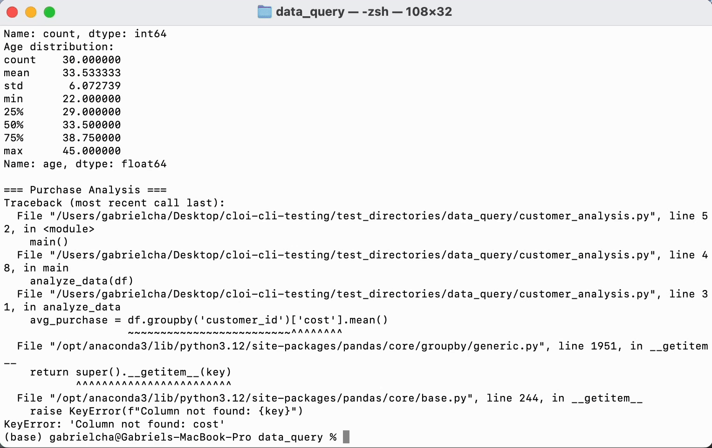

# <div align="center">Cloi CLI</div>

<div align="center">Your Local AI Debugging Assistant</div>

<br>

<div align="center"></div>

<br>

cloi is a local, context-aware AI assistant designed to streamline your debugging process. Operating entirely on your machine, it ensures that your code and data remain private and secure. With your permission, cloi can analyze errors and apply fixes directly to your codebase, enhancing productivity while maintaining control.

## Disclaimer
cloi CLI is an experimental project under active development. May contain bugs or undergo breaking changes. Contributions welcome!

> **Note:** The automated code change feature is currently in beta. While it can suggest and apply fixes, we recommend reviewing all changes before accepting them.


<details>
<summary><strong>Table of Contents</strong></summary>

- [Quickstart](#quickstart)
- [Usage](#usage)
  - [Basic Command](#basic-command)
  - [Interactive Mode](#interactive-mode-commands)
  - [System Requirements](#system-requirements)
- [Benchmarks](#benchmarks)
- [Contributing](#contributing)
- [License](#license)
</details>


## Quickstart
```bash
# Install globally (recommended)
npm install -g @cloi-ai/cloi

# Or run with npx
npx @cloi-ai/cloi
```

This will install the cloi command and set up the necessary shell integration.

CLOI will automatically detect if Ollama is installed on your system and install it if necessary. It will also download the default language model (phi4) required for analysis.


## Usage

### Basic Command
```bash
# Start interactive mode
cloi
```

### Interactive Mode Commands
```
/debug    - Auto-patch errors iteratively using LLM
/model    - Pick Ollama model
/history  - Pick from recent shell commands
/help     - Show this help
/exit     - Quit
```

### System Requirements
- Operating System:
  - Optimized for macOS (Big Sur 11.0+)
  - Compatible with Linux (limited testing)
  - Windows support via WSL
- Hardware:
  - Memory: Minimum 8GB RAM (16GB+ recommended for Ollama models)
  - Storage: 2GB+ free disk space for models (phi4 requires ~1.5GB)
  - Processor: Multi-core CPU (M1/M2/M3/Intel i5+ recommended)
- Software Prerequisites:
  - Node.js 14+
  - Python 3.6+
  - zsh shell
- Automatic Dependencies:
  - Ollama will be automatically installed if not detected on your system

> **Beta Feature Notice:** The `cloi fix` command is currently in beta. While it can automatically apply fixes to your code, we strongly recommend:
> - Reviewing all suggested changes before accepting them
> - Testing the changes in a development environment first
> - Keeping backups of your code before using automated fixes
> - Reporting any issues or unexpected behavior

## Benchmarks
cloi has been benchmarked against leading debugging tools. Below is a comparison of execution times:

Benchmarks conducted on macOS [14.3], Apple [M2] MacBook Air, [24GB RAM].*

| Feature | cloi | Warp | OpenAI Codex | Claude Code | Cursor | Windsurf |
|---------|------|-------------|--------------|----|---|---|
| Cost | Free | $40/month | $0.10/1K tokens | $3/1M input tokens, $15/1M output​ tokens | $20/month | $15/month + $10/250 creds |
| Local Processing | Yes | No | No | No | Partial | No |
| Offline Support | Yes | Limited | No | No | Limited | No |
| Analysis Time* | 10s | 10s | 10s | 10s | 10s | 10s |

## Contributing
We welcome contributions from the community! By contributing to this project, you agree to the following guidelines:

### Guidelines
- Scope: Contributions should align with the project's goals of providing a secure, local AI debugging assistant
- Non-Commercial Use: All contributions must adhere to the CC BY-NC 4.0 license
- Attribution: Please ensure proper attribution for any third-party work
- Code of Conduct: Be respectful and considerate in all interactions

### How to Contribute
1. Fork the Repository
2. Create a Branch:
```bash
git checkout -b feature/your-feature-name
```
3. Make Changes: Implement your changes with clear commit messages
4. Push to Your Fork:
```bash
git push origin feature/your-feature-name
```
5. Submit a Pull Request
6. Review Process: Your PR will be reviewed, and feedback may be provided

For more detailed information on contributing, please refer to the CONTRIBUTING.md file.

## License
This project is licensed under the Creative Commons Attribution-NonCommercial 4.0 International License (CC BY-NC 4.0).

Summary:
- Attribution Required: You must give appropriate credit, provide a link to the license, and indicate if changes were made
- NonCommercial: You may not use the material for commercial purposes
- No Additional Restrictions: You may not apply legal terms or technological measures that legally restrict others from doing anything the license permits

For the full license text, please refer to the [Creative Commons website](https://creativecommons.org/licenses/by-nc/4.0/).
