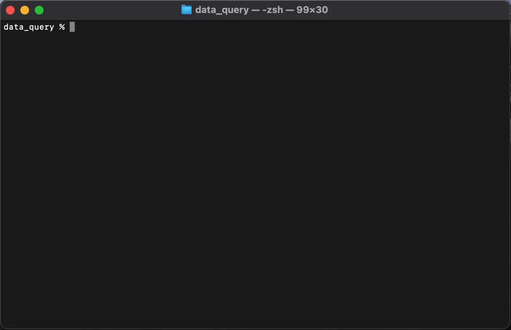

# <div align="center">Cloi CLI (beta preview)</div>

<div align="center">Local debugging agent that runs in your terminal</div>
<br>
<div align="center">
  
  
</div>
<br>
<div align="center"></div>

## Overview

Cloi is a local, context-aware agent designed to streamline your debugging process. Operating entirely on your machine, it ensures that your code and data remain private and secure. With your permission, Cloi can analyze errors and apply fixes directly to your codebase.

**Disclaimer:** Cloi is an experimental project under beta development. It may contain bugs, and we recommend reviewing all changes before accepting agentic suggestions. That said, help us improve Cloi by filing issues or submitting PRs, see down below for more info.

## Installation

Install globally: 

```bash
npm install -g @cloi-ai/cloi
```

**Works with your existing Ollama models - zero setup, no API key required.**

Navigate to your project directory and call Cloi when you run into an error.

```bash
cloi
```

### Why use Cloi?

Cloi is built for developers who live in the terminal and value privacy:

- **On-Device or API Models** – Choose between local Ollama models or cloud Claude models (Sonnet 4, Opus).
- **Smart Context Retrieval** – RAG system automatically finds relevant code files for better debugging.
- **Automatic Error Capture** – Terminal logging catches errors without re-running commands.
- **Safe Changes** – Review all diffs before applying. Full control to accept or reject.
- **Zero Setup** – RAG models, indexing, and dependencies install automatically on first use.
- **Free to Use** – Extensible architecture. Fork, contribute, and customize to your needs.

### Interactive Mode Commands
```
/debug    - Auto-fix errors using AI models (sets up RAG automatically)
/index    - Re-index your codebase for improved debugging accuracy
/model    - Pick a different AI model (Ollama or Claude)
/logging  - Set up automatic error logging (zsh only)
/help     - Show available commands
```

### Using Claude-4 Model

Want to use Claude Sonnet 4 or Opus-4 instead of local models? Just add your API key:
>
>```bash
>export ANTHROPIC_API_KEY="your-api-key-here"
>```
>
>Add this line to your `~/.zshrc` file, then restart your terminal. Claude models will automatically appear in `/model` selection - zero additional setup required.

### RAG

Cloi uses Retrieval-Augmented Generation to find relevant code files across your entire codebase when debugging. RAG combines CodeBERT (500 MB) embeddings with BM25 keyword search to identify files related to your error. Auto-installs on first `/debug` run.

### Terminal Logging

Enable automatic error capture without making cloi re-run commands. Run `/logging` to modify your `.zshrc`, then restart your terminal. All output gets saved to `~/.cloi/terminal_output.log` with auto-rotation (1 MB). (zsh only)
**Note:** Currently only tested with zsh shell.

### System Requirements

<table>
<tr>
  <td><b>🖥️ Hardware</b></td>
  <td>
    • <b>Memory:</b> 8GB RAM minimum (16GB+ recommended)<br>
    • <b>Storage:</b> 10GB+ free space (Phi-4 model: ~9.1GB)<br>
    • <b>Processor:</b> Tested on M2 and M3
  </td>
</tr>
<tr>
  <td><b>💻 Software</b></td>
  <td>
    • <b>OS:</b> macOS (Big Sur 11.0+)<br>
    • <b>Runtime:</b> Node.js 14+ and Python 3.6+<br>
    • <b>Shell:</b> Zsh, Fish, Bash (limited testing)<br>
    • <b>Dependencies:</b> Ollama (automatically installed if needed)
  </td>
</tr>
</table>

### Contributing

We welcome contributions from the community! By contributing to this project, you agree to the following guidelines:

- **Scope:** Contributions should align with the project's goals of providing a secure, local AI debugging assistant
- **License:** All contributions must be licensed under the GNU General Public License v3.0 (GPL-3.0)
- **Copyleft:** Any derivative works must also be distributed under the GPL-3.0 license

For more detailed information on contributing, please refer to the [CONTRIBUTING.md](CONTRIBUTING.md) file.

---

### Patches 

#### [1.0.8] - May 28, 2025 @ 4:00am PST
- **Feature:** Integrated Retrieval-Augmented Generation (RAG) for enhanced debugging
  - Hybrid Search Algorithm: Combines BM25 keyword matching with semantic vector search for optimal code retrieval
  - FAISS Vector Store: Uses Facebook's FAISS library for efficient similarity search across code embeddings
  - CodeBERT Embeddings: Leverages Hugging Face's microsoft/codebert-base model for code understanding
  - Automatic Setup: Downloads CodeBERT model (~500MB) and installs Python dependencies automatically on first `/debug` run
  - Background Service: CodeBERT runs as local HTTP service (port 3090) for fast embedding generation

#### [1.0.7] - May 16th, 2025 @ 2:45pm PST
- **Feature:** Added automatic terminal output logging (zsh only)
  - Logs terminal output to `~/.terminal_output.log` for better error analysis
  - Requires explicit user permission before modifying `.zshrc`
  - Configure with `/logging` command 

#### [1.0.6] - May 5th, 2025 @ 5:30pm PST
- **Feature:** Included new `phi4-reasoning:plus`,`qwen3`, and ALL your locally installed Ollama models into boxen `/model` for easy access.

<div align="center"></div>

#### [1.0.5] - May 4th, 2025 @ 9:10pm PST

- **Bug Fix**: Resolved dependency issue in package.json
  - Updated Ollama dependency from deprecated version 0.1.1 to 0.5.15 which resolved ollama.chat API endpoints
  - Thank you [@kingkongfft](https://github.com/kingkongfft) and [@undecomposed](https://github.com/undecomposed) for alerting by submitting this issue. 

#### [1.0.2] - May 4th, 2025 @ 12:20pm PST

- **Feature:** Integrated [structured outputs](https://ollama.com/blog/structured-outputs) from Ollama's latest API
  - Creates more robust patches with JSON-based formatting
  - Falls back to traditional LLM calls if the structured API isn't available
- **Feature:** Implemented CLI model selection via `--model` flag
  - Specify your preferred Ollama model right from the command line
  - Credit to [@canadaduane](https://github.com/canadaduane) for the insightful suggestion!
- **UI Enhancement:** The `/model` command now displays ALL you locally installed Ollama models 
- **Refactor:** Internal architecture adjustments to maintain conceptual integrity
  - Migrated `history.js` to the utils directory where it semantically belongs
  - Repositioned `traceback.js` to core since it's foundational to the debugging pipeline
- **Improvements:** Purged lingering references to our project's original name "FigAI" and cleaned the CLI `--help` interface

