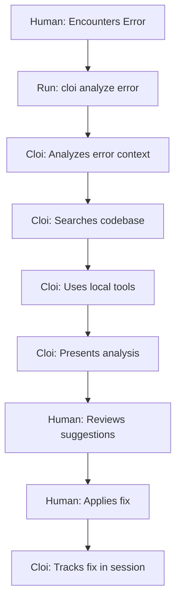
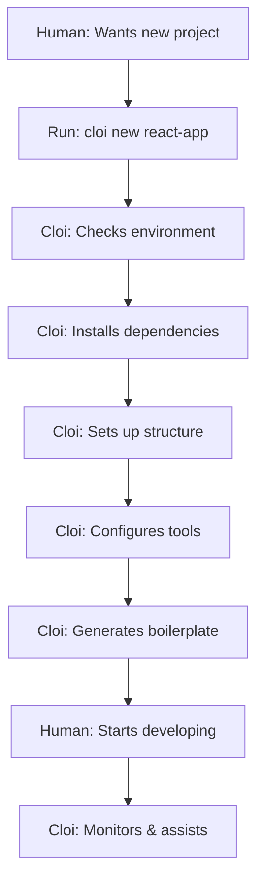
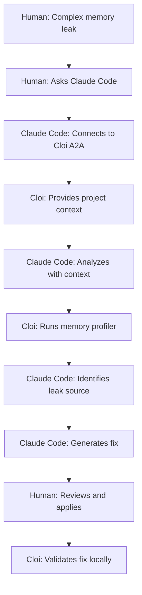
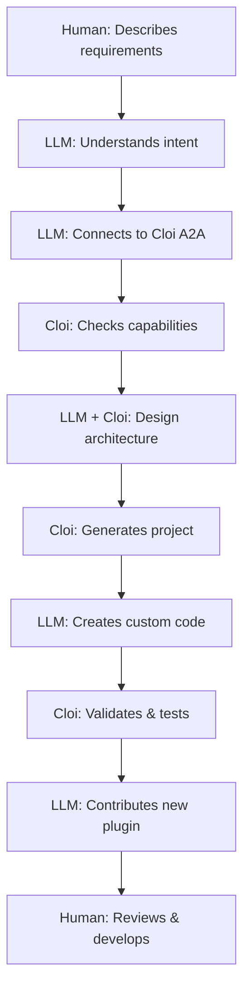

# Cloi Workflow Guide (Vision & Roadmap)

> ⚠️ **IMPORTANT**: This document describes the **vision and roadmap** for Cloi workflows. For current implementation status, see [WORKFLOWS_STATUS.md](./WORKFLOWS_STATUS.md).
> 
> **Currently Implemented**: Basic error analysis and A2A framework only.  
> **Not Yet Implemented**: Project generation, advanced debugging tools, intelligent A2A collaboration.

This guide demonstrates four key workflows showing how humans, Cloi, and LLMs will collaborate in different scenarios.

## Workflow 1: Human + Cloi - Debugging Existing Project

**Scenario**: Developer encounters an error in their existing Node.js application.



### Step-by-Step

1. **Human encounters error**
   ```bash
   $ npm run build
   TypeError: Cannot read property 'map' of undefined
   ```

2. **Human runs Cloi**
   ```bash
   $ cloi analyze "TypeError: Cannot read property 'map' of undefined" --files src/components/List.js
   ```

3. **Cloi analyzes**
   - Examines error context
   - Searches for similar patterns in codebase
   - Checks git history for recent changes
   - Runs static analysis tools

4. **Cloi presents findings**
   ```
   🔍 Analysis Results:
   - Error in: src/components/List.js:42
   - Likely cause: items prop is undefined
   - Similar pattern found in: src/components/Table.js (has null check)
   
   💡 Suggested fix:
   const items = props.items || [];
   ```

5. **Human applies fix**
   - Reviews Cloi's suggestion
   - Implements the fix
   - Tests the solution

6. **Cloi tracks resolution**
   - Records fix in session history
   - Updates knowledge base

## Workflow 2: Human + Cloi - New Project Setup

**Scenario**: Developer starting a new React project with best practices.



### Step-by-Step

1. **Human initiates new project**
   ```bash
   $ cloi new react-app my-awesome-app
   ```

2. **Cloi environment check**
   - Verifies Node.js version
   - Checks for required tools
   - Identifies system capabilities

3. **Cloi project setup**
   ```bash
   ✅ Creating project structure
   ✅ Installing React and dependencies
   ✅ Setting up ESLint, Prettier
   ✅ Configuring testing framework
   ✅ Initializing git repository
   ```

4. **Cloi generates smart boilerplate**
   - Creates component templates
   - Sets up folder structure
   - Adds common utilities
   - Configures development scripts

5. **Human begins development**
   ```bash
   $ cd my-awesome-app
   $ npm start
   ```

6. **Cloi provides ongoing assistance**
   - Monitors for common mistakes
   - Suggests optimizations
   - Tracks project evolution

## Workflow 3: Human + LLM + Cloi - Complex Bug Fix in Existing Project

**Scenario**: Developer needs help fixing a complex memory leak in their production app.



### Step-by-Step

1. **Human describes problem to LLM**
   ```
   Human: "My Node.js app has a memory leak that's crashing production every few hours"
   ```

2. **Claude Code connects to Cloi**
   ```javascript
   // Claude Code internally
   const cloi = await connectToCloi('ws://localhost:9090');
   const project = await cloi.understandProject('comprehensive');
   ```

3. **Cloi provides deep context**
   ```json
   {
     "project": {
       "type": "node-express",
       "version": "18.x",
       "dependencies": ["mongoose", "redis", "socket.io"],
       "structure": { /* file tree */ },
       "recentChanges": [ /* git commits */ ]
     }
   }
   ```

4. **Claude Code + Cloi collaborate**
   ```javascript
   // Claude Code requests profiling
   const profiling = await cloi.useCloiTools([
     { name: 'memory-profiler', operation: 'heap-snapshot' },
     { name: 'log-analyzer', operation: 'scan', params: { pattern: 'memory' }}
   ]);
   ```

5. **Cloi executes local tools**
   - Runs Node.js heap profiler
   - Analyzes application logs
   - Checks for unclosed connections

6. **Claude Code identifies issue**
   ```
   Claude Code: "I've analyzed your heap snapshots with Cloi. The memory leak is in 
   src/services/websocket.js:87 - event listeners aren't being removed when clients 
   disconnect. Here's the fix..."
   ```

7. **Human applies fix**
   - Reviews the specific, contextual solution
   - Implements the fix
   - Tests locally

8. **Cloi validates**
   ```bash
   ✅ Memory usage stable after fix
   ✅ All tests passing
   ✅ No regression detected
   ```

## Workflow 4: Human + LLM + Cloi - AI-Assisted New Project with Custom Requirements

**Scenario**: Developer wants to create a new microservice with specific architectural requirements.



### Step-by-Step

1. **Human describes to LLM**
   ```
   Human: "I need a Node.js microservice with gRPC, structured logging, 
   OpenTelemetry tracing, and automatic API documentation"
   ```

2. **Claude Code connects to Cloi**
   ```javascript
   const cloi = await connectToCloi('ws://localhost:9090');
   const capabilities = await cloi.analyzeCapabilityGaps();
   ```

3. **Cloi reports available tools**
   ```json
   {
     "available": ["node-setup", "express-generator", "eslint"],
     "missing": ["grpc-generator", "otel-setup", "api-doc-generator"]
   }
   ```

4. **LLM + Cloi collaborate on architecture**
   ```javascript
   // Claude Code + Cloi design the service
   const architecture = await cloi.collaborateRealTime({
     type: 'architecture-design',
     context: {
       requirements: ['grpc', 'structured-logging', 'opentelemetry'],
       constraints: ['microservice', 'scalable', 'observable']
     }
   });
   ```

5. **Cloi generates base project**
   ```bash
   $ cloi new microservice my-grpc-service --template node-advanced
   ```

6. **Claude Code creates custom components**
   - Generates gRPC service definitions
   - Creates OpenTelemetry configuration
   - Sets up structured logging
   - Implements API documentation

7. **Cloi validates everything**
   ```bash
   ✅ Running integration tests
   ✅ Checking gRPC endpoints
   ✅ Validating OpenTelemetry spans
   ✅ Generating API documentation
   ```

8. **LLM contributes missing capability**
   ```javascript
   // Claude Code contributes new plugin
   await cloi.contributePlugin({
     name: 'grpc-microservice-generator',
     type: 'generators',
     description: 'Complete gRPC microservice setup with observability',
     repository: 'https://github.com/tosin2013/cloi.git',
     submitPR: true
   });
   ```

9. **Human receives complete solution**
   ```
   Claude Code: "I've created your microservice with all requirements. 
   Cloi has validated everything works locally. I've also contributed 
   a new plugin so future users can create similar services easily.
   
   Start with: cd my-grpc-service && npm start
   Monitor at: http://localhost:9464/metrics
   Traces at: http://localhost:16686
   ```

## Key Takeaways

### Human + Cloi Workflows
- **Direct**: Human uses Cloi's CLI directly
- **Local**: All processing happens on developer's machine
- **Fast**: Immediate feedback and assistance
- **Privacy**: No data leaves the local environment

### Human + LLM + Cloi Workflows
- **Enhanced**: LLM intelligence + Cloi's local knowledge
- **Contextual**: LLM gets real project understanding
- **Collaborative**: Best of both AI capabilities
- **Evolutionary**: LLMs can contribute improvements back

### For Existing Projects
- Cloi provides deep understanding of current codebase
- Tools analyze actual files and dependencies
- Git history informs debugging
- Local validation ensures fixes work

### For New Projects
- Cloi sets up with best practices
- LLMs can design custom architectures
- Missing capabilities trigger plugin creation
- Community benefits from contributions

## Workflow Commands Reference

```bash
# Direct Cloi workflows
cloi analyze "error message"              # Debug existing project
cloi new <template> <name>               # Create new project
cloi session history                     # Review past fixes
cloi plugins list                        # See available tools

# A2A-enabled workflows (with LLMs)
cloi a2a start                          # Enable LLM collaboration
cloi a2a status                         # Check connection
cloi config set a2a.autostart true      # Always enable A2A
```

These workflows demonstrate how Cloi bridges the gap between human developers, local development environments, and AI assistants to create a more intelligent and collaborative development experience.