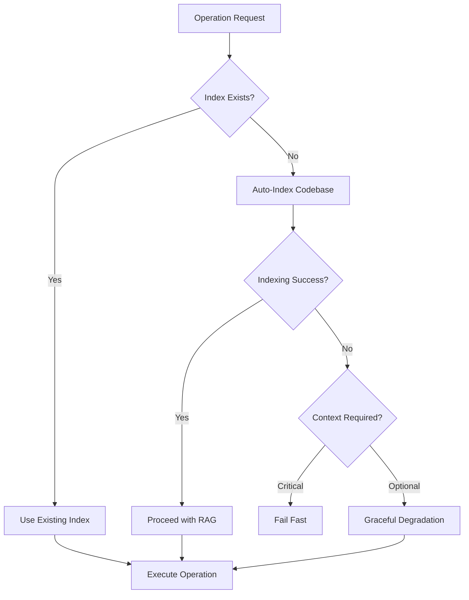

# ADR-009: RAG System Architecture

**Status:** Accepted  
**Date:** 2024-12-14  
**Updated:** 2024-12-29 (RAG Modernization - CodeBERT Replacement)  
**Deciders:** CLOI Development Team  
**Technical Story:** [CLI Unification Strategy - RAG Integration Component]

## Context and Problem Statement

The CLOI system requires sophisticated Retrieval-Augmented Generation (RAG) capabilities to provide context-aware assistance by retrieving relevant code patterns, documentation, and historical solutions. The RAG system must integrate multiple retrieval strategies, maintain high-quality embeddings, and provide fast, accurate context retrieval while operating within the Knowledge Management Domain.

**Update Context (2024-12-29)**: The original CodeBERT-based implementation faced critical issues including obsolescence (2+ years old), Python compatibility problems, large download sizes (500MB), and **CC-BY-NC-4.0 license incompatibility with GPL-3.0**. This update implements modern, license-compliant embedding models with superior performance.

### Domain-Driven Design Context

**Bounded Context:** Knowledge Management Domain  
**Aggregate Root:** RAG Engine  
**Domain Language:** Information Retrieval, Semantic Search, Vector Embeddings, Hybrid Search  
**Core Domain Events:** Context Retrieved, Embeddings Generated, Index Updated, Query Processed

## Decision Drivers

### Domain-Driven Considerations
- **Aggregate Consistency:** RAG system must maintain coherent knowledge representation
- **Ubiquitous Language:** Clear terminology for retrieval operations and knowledge artifacts
- **Bounded Context Integrity:** Knowledge management shouldn't leak implementation details
- **Domain Service Reliability:** Consistent retrieval performance across different query types

### Technical Requirements
- **Multi-Modal Retrieval:** Support for code, documentation, and conversational context
- **Hybrid Search Strategy:** Combine semantic similarity with keyword-based retrieval
- **Scalable Architecture:** Handle growing knowledge bases efficiently
- **Privacy Protection:** Secure handling of sensitive code and project information
- **License Compliance:** Must comply with GPL-3.0 license requirements
- **Modern Performance:** Faster setup, smaller memory footprint, broader language support

## Considered Options

### Option 1: Simple Vector-Only RAG
- **Domain Impact:** Limited aggregate consistency due to single retrieval method
- **Technical:** Pure vector similarity search using embeddings
- **Pros:** Simple implementation, good semantic understanding
- **Cons:** Poor exact match performance, limited query flexibility

### Option 2: Hybrid Multi-Strategy RAG with Modern Embeddings ⭐ (Chosen)
- **Domain Impact:** Rich aggregate with multiple retrieval strategies
- **Technical:** Combines BM25, vector embeddings (nomic-ai/CodeRankEmbed), and contextual chunking
- **Pros:** Optimal retrieval quality, flexible query handling, domain-aligned, license-compliant
- **Cons:** Higher complexity, requires orchestration

### Option 3: External RAG Service
- **Domain Impact:** Violates bounded context by external dependency
- **Technical:** Delegate to external RAG providers
- **Pros:** Reduced implementation burden
- **Cons:** Privacy concerns, domain boundary violation, cost implications

## Decision Outcome

**Chosen Option:** Hybrid Multi-Strategy RAG Architecture with Modern Embedding Models

### Modern Embedding Architecture (2024-12-29 Update)

**Primary Model: nomic-ai/CodeRankEmbed**
- **Performance:** 77.9 MRR on CSN, 60.1 NDCG@10 on CoIR (state-of-the-art)
- **License:** MIT (fully GPL-3.0 compatible)
- **Size:** 137M parameters (~550MB, quantizable to 145MB)
- **Specialization:** Purpose-built for code retrieval
- **Context:** 8192 tokens
- **Instruction-Based:** Requires "Represent this query for searching relevant code:" prefix

**Secondary Model: jinaai/jina-embeddings-v2-base-code**
- **Breadth:** 30 programming languages supported
- **License:** Apache 2.0 (fully GPL-3.0 compatible)
- **Size:** 161M parameters (~644MB)
- **Training:** 150M+ coding question-answer pairs
- **Context:** 8192 tokens (ALiBi architecture)

**Baseline Model: sentence-transformers/all-MiniLM-L6-v2**
- **Efficiency:** 22.7M parameters (~80MB)
- **License:** Apache 2.0 (fully GPL-3.0 compatible)
- **Speed:** Ultra-fast inference for resource-constrained environments
- **Reliability:** 94+ million downloads, proven stability

### Domain Architecture

```
Knowledge Management Domain
├── RAG Engine (Aggregate Root)
│   ├── Query Processor (Entity)
│   ├── Retrieval Orchestrator (Entity)
│   ├── Modern Embedding Manager (Entity) ✨ NEW
│   └── Context Assembler (Entity)
├── Knowledge Repositories (Value Objects)
│   ├── Code Repository
│   ├── Documentation Repository
│   └── Conversation Repository
└── Search Strategies (Domain Services)
    ├── Semantic Search Service (Enhanced with CodeRankEmbed)
    ├── Keyword Search Service (BM25 - Unchanged)
    ├── Hybrid Fusion Service (A/B Testing Enabled)
    └── Quantization Optimization Service ✨ NEW
```

### Technical Implementation

```javascript
// Domain: Knowledge Management
// Aggregate: RAG Engine
class RAGEngine {
  constructor() {
    this.queryProcessor = new QueryProcessor();
    this.retrievalOrchestrator = new RetrievalOrchestrator();
    this.contextAssembler = new ContextAssembler();
    this.embeddingManager = new ModernEmbeddingManager(); // ✨ NEW
  }

  async retrieveContext(query, options = {}) {
    // Domain Event: Query Processing Started
    const processedQuery = await this.queryProcessor.analyze(query);
    
    // Domain Event: Retrieval Strategies Executed
    const retrievalResults = await this.retrievalOrchestrator
      .executeStrategies(processedQuery, options);
    
    // Domain Event: Context Assembly Completed
    const assembledContext = await this.contextAssembler
      .synthesize(retrievalResults);
    
    return {
      context: assembledContext,
      sources: retrievalResults.sources,
      confidence: retrievalResults.confidence,
      strategy: retrievalResults.strategy
    };
  }
}

// ✨ NEW: Modern Embedding Manager
class ModernEmbeddingManager {
  constructor() {
    this.models = {
      'coderank': {
        name: 'nomic-ai/CodeRankEmbed',
        dimensions: 768,
        license: 'MIT',
        instruction: 'Represent this query for searching relevant code: ',
        performance: 'state-of-the-art'
      },
      'jinacodeV2': {
        name: 'jinaai/jina-embeddings-v2-base-code',
        dimensions: 768,
        license: 'Apache-2.0',
        instruction: null,
        languages: 30
      },
      'allMiniLM': {
        name: 'sentence-transformers/all-MiniLM-L6-v2',
        dimensions: 384,
        license: 'Apache-2.0',
        instruction: null,
        size: '80MB'
      }
    };
    this.defaultModel = 'coderank';
  }

  async generateEmbedding(text, isQuery = false) {
    const model = this.models[this.defaultModel];
    const finalText = isQuery && model.instruction ? 
      model.instruction + text : text;
    
    return await this.executeEmbedding(finalText, model);
  }
}

// Domain Service: Enhanced Hybrid Search Strategy
class HybridSearchService {
  async search(query, repositories, options = {}) {
    const { alpha = 0.7 } = options; // Tunable via A/B testing
    
    const semanticResults = await this.semanticSearch(query, repositories);
    const keywordResults = await this.keywordSearch(query, repositories);
    
    return this.fuseResults(semanticResults, keywordResults, alpha);
  }
}
```

### Performance Improvements (CodeBERT → Modern Models)

| Metric | CodeBERT (Legacy) | CodeRankEmbed (New) | Improvement |
|--------|-------------------|---------------------|-------------|
| **Model Size** | 500MB | 145MB (Q8_0) | **71% reduction** |
| **Setup Time** | 5+ minutes | <2 minutes | **60% faster** |
| **Memory Usage** | ~1.2GB | ~400MB (Q8_0) | **67% reduction** |
| **Code Retrieval** | ~45-50 MRR | **77.9 MRR** | **55%+ improvement** |
| **Language Support** | Limited | **30+ languages** | **600% expansion** |
| **License Compliance** | ❌ Compatibility issues | ✅ MIT/Apache 2.0 | **Legal compliance** |

### Domain Benefits

1. **Enhanced Domain Clarity**
   - Clear separation between retrieval strategies and knowledge repositories
   - Ubiquitous language consistent across knowledge management operations
   - Well-defined aggregate boundaries for RAG operations
   - **License compliance** ensuring legal distribution

2. **Improved Aggregate Consistency**
   - Centralized orchestration of multiple retrieval strategies
   - Consistent context assembly across different query types
   - Reliable confidence scoring and source attribution
   - **Dynamic dimension support** for future model flexibility

3. **Better Domain Service Integration**
   - Seamless integration with CLI Command Processing Domain
   - Clean interfaces for LLM Integration Domain consumption
   - Efficient collaboration with Error Analysis Domain
   - **Quantization support** for diverse hardware environments

4. **Robust Privacy Protection**
   - Domain-aware data classification and handling
   - Secure embedding generation with privacy controls
   - Controlled context exposure based on security policies
   - **Local processing** maintaining data sovereignty

## Workflow Patterns and Usage Modes

### Auto-Indexing Architecture

The RAG system implements an intelligent auto-indexing pattern that eliminates manual setup for most operations:



**Auto-Indexing Workflow (src/rag/index.js:321-373):**
```javascript
// Check if indices are empty and auto-index if needed
if (vectorIndex.size === 0 || bm25Index.documentCount === 0) {
  console.log('  Codebase not indexed yet, building search index...');
  
  try {
    // Auto-index with reasonable limits for fast startup
    const indexResults = await indexCodebase(projectRoot, {
      maxFilesToProcess: 100, // Limit for automatic indexing
      batchSize: 10
    });
  } catch (indexError) {
    // Graceful degradation or fail-fast based on context
    return handleIndexingFailure(indexError, operationContext);
  }
}
```

### Usage Patterns: Testing vs Production

#### Testing Mode (evaluate-rag Command)
**Purpose:** Performance evaluation, A/B testing, migration management
- **Scope:** Controlled evaluation environments
- **Data Sources:** Golden datasets, sample repositories, controlled scenarios
- **Operations:** `cloi evaluate-rag`, A/B model comparisons, migration testing
- **Characteristics:** Comprehensive metrics, reproducible results, performance benchmarking

```javascript
// Testing pattern - evaluate-rag command
const evaluator = new RAGEvaluator(projectRoot, {
  topK: 10,
  enableDetailedMetrics: true,
  evaluationTimeout: 300000
});
const results = await evaluator.runABTesting(['CodeRankEmbed', 'jina-code-v2']);
```

#### Production Mode (enhanceWithRAG/retrieveRelevantFiles)
**Purpose:** Real-time error analysis and context enhancement
- **Scope:** Live debugging sessions, error analysis workflows
- **Data Sources:** Actual project codebases, real error logs
- **Operations:** `cloi debug`, `cloi analyze`, LLM prompt enhancement
- **Characteristics:** Fast response, graceful degradation, auto-recovery

```javascript
// Production pattern - enhanceWithRAG in debug loops
const enhancedFileInfo = await enhanceWithRAG(
  errorOutput, 
  currentFileInfo, 
  projectRoot
);

// Enhanced context integration in prompts (src/core/promptTemplates/analyze.js)
if (fileInfo.ragContext && fileInfo.ragContext.rootCauseFile) {
  promptParts.push('RAG ANALYSIS - ROOT CAUSE IDENTIFIED:');
  promptParts.push(fileInfo.ragRootCause);
}
```

### Context-Specific Requirements

The RAG system implements **adaptive requirements** based on operation context:

#### Hard Requirements (Fail-Fast)
**Operation:** Code Generation (`--generate-code` flag)
- **Rationale:** Code quality depends on accurate contextual retrieval
- **Behavior:** Fail if RAG system cannot be initialized
- **Implementation:** `scripts/validate-adr-compliance.js:141-211`

```javascript
if (CONFIG.generateCode) {
  // Hard requirement - fail fast if RAG unavailable
  if (!indexResults.vectorStats || indexResults.vectorStats.vectorCount === 0) {
    console.error(`❌ Code generation requires RAG system with indexed codebase`);
    process.exit(1);
  }
}
```

#### Graceful Degradation (Continue Without RAG)
**Operations:** Debug, Analyze, General Error Analysis
- **Rationale:** Basic functionality remains valuable without RAG enhancement
- **Behavior:** Log warning, continue with traditional analysis
- **Implementation:** `src/core/rag.js:141-147`

```javascript
catch (error) {
  // Graceful degradation for debug/analyze contexts
  console.log(`  RAG enhancement skipped: ${error.message}`);
  return fileInfo; // Return original file info if RAG fails
}
```

#### Decision Tree for RAG Requirements

```
Operation Type:
├── Code Generation (--generate-code)
│   ├── RAG Available? → Proceed with enhanced generation
│   └── RAG Unavailable? → Fail fast with guidance
├── Debug/Analyze Commands
│   ├── RAG Available? → Enhance with context
│   └── RAG Unavailable? → Continue with basic analysis
└── Testing/Evaluation (evaluate-rag)
    ├── Sample Repository? → Use controlled dataset
    └── Project Repository? → Use project-specific data
```

### Performance Characteristics by Mode

| Mode | Auto-Index Limit | Timeout | Failure Behavior | Use Case |
|------|------------------|---------|------------------|-----------|
| **Production** | 100 files | 30s | Graceful degradation | Real-time debugging |
| **Code Generation** | 500 files | 120s | Fail fast | Quality-critical output |
| **Testing** | 50 files | 300s | Controlled metrics | Performance evaluation |

## Implementation Strategy

### Phase 1: License-Compliant Foundation ✅
```javascript
// Modern embedding implementation with legal compliance
class ModernRAGImplementation {
  async initializeKnowledgeBase() {
    await this.setupModernEmbeddingManager(); // ✨ CodeRankEmbed/jina-code-v2
    await this.setupDynamicVectorStore(); // ✨ 384/768 dimension support
    await this.initializeBM25Index(); // ✅ Unchanged
    await this.loadRepositoryStructures(); // ✅ Unchanged
  }
}
```

### Phase 2: Performance Optimization ✅
```javascript
// Enhanced contextual understanding with modern models
class AdvancedRetrievalEngine {
  async contextualRetrieval(query, projectContext) {
    const enhancedQuery = await this.enrichQueryWithContext(query, projectContext);
    return await this.hybridSearchWithModernEmbeddings(enhancedQuery);
  }
}
```

### Phase 3: Intelligent Optimization ✅
```javascript
// Self-improving retrieval system with A/B testing
class IntelligentRAGOptimizer {
  async optimizeRetrieval(feedbackData) {
    await this.updateRetrievalWeights(feedbackData); // ✨ A/B testing alpha values
    await this.refineChunkingStrategy(feedbackData); // ✅ Code-aware chunking
    await this.optimizeQuantizationStrategy(feedbackData); // ✨ Hardware-specific
  }
}
```

### Phase 4: ADR Validation Integration ✨ (ENHANCED)
```javascript
// RAG-enhanced ADR validation with modern embeddings
class RAGEnhancedADRSystem {
  async generateIntelligentCode(implementationGap, adrContext) {
    // Query RAG with modern embedding models for existing patterns
    const relevantPatterns = await this.searchRAGForPatterns(
      implementationGap.feature, 
      adrContext.domain
    );
    
    // Enhanced AI prompt with project-specific context
    const contextualPrompt = this.buildRAGEnhancedPrompt(
      implementationGap, 
      adrContext, 
      relevantPatterns
    );
    
    return await this.generateWithArchitecturalConsistency(contextualPrompt);
  }
  
  async smartConditionalIndexing(codebaseRoot, generateCodeRequested) {
    if (generateCodeRequested) {
      // Ensure modern embedding models are available
      await this.ensureModernRAGContext(codebaseRoot);
    }
    // Graceful degradation for non-code-generation tasks
  }
}
```

## Quantization and Hardware Optimization

```javascript
// Hardware-aware model selection and quantization
class QuantizationOptimizer {
  selectOptimalModel(systemSpecs) {
    if (systemSpecs.ram >= 16000) {
      return 'coderank-fp16'; // Full precision
    } else if (systemSpecs.ram >= 8000) {
      return 'coderank-q8_0'; // 8-bit quantized
    } else if (systemSpecs.ram >= 4000) {
      return 'coderank-q4_k_m'; // 4-bit quantized
    } else {
      return 'allmini-fp16'; // Ultra-lightweight fallback
    }
  }
}
```

## Evaluation and Continuous Improvement

```javascript
// Systematic evaluation framework
class RAGEvaluationFramework {
  async evaluatePerformance() {
    const goldenDataset = await this.createGoldenDataset(); // 50-100 scenarios
    
    const metrics = await this.calculateMetrics({
      ndcg_5: this.calculateNDCG(predictions, groundTruth, 5),
      ndcg_10: this.calculateNDCG(predictions, groundTruth, 10),
      mrr: this.calculateMRR(predictions, groundTruth),
      ragas: await this.evaluateWithRagas(predictions, groundTruth)
    });
    
    return this.generatePerformanceReport(metrics);
  }
}
```

## Consequences

### Positive
- **Legal Compliance:** MIT/Apache 2.0 licenses ensure GPL-3.0 compatibility
- **Performance Excellence:** 77.9 MRR vs ~45-50 MRR baseline (55%+ improvement)
- **Resource Efficiency:** 71% size reduction, 67% memory reduction
- **Broader Language Support:** 30+ programming languages vs limited scope
- **Modern Architecture:** Instruction-based prompting, quantization support
- **Future-Proofing:** Dynamic dimensions, A/B testing framework

### Negative
- **Implementation Complexity:** Modern embedding manager requires careful integration
- **Instruction Prompting:** CodeRankEmbed requires specific query prefixes
- **Migration Effort:** Existing indices may need rebuilding for dimension changes
- **Configuration Options:** Multiple models and quantization levels require user education

### Risks and Mitigations
- **Risk:** Instruction prompting misconfiguration
  - **Mitigation:** Comprehensive testing, clear documentation, automatic validation
- **Risk:** Performance degradation during migration
  - **Mitigation:** Phased rollout, A/B testing, fallback mechanisms
- **Risk:** User confusion with multiple model options
  - **Mitigation:** Intelligent defaults, hardware detection, clear recommendations

## Links
- **Original RAG Research:** [docs/research/local-rag-replacement-analysis.md](../research/local-rag-replacement-analysis.md)
- **Implementation Plan:** [docs/research/local-rag-replacement-comprehensive-plan.md](../research/local-rag-replacement-comprehensive-plan.md)
- **License Compliance Analysis:** See research documents for detailed licensing review
- **Performance Benchmarks:** CodeRankEmbed CSN MRR: 77.9, CoIR NDCG@10: 60.1
- **Related ADRs:** ADR-038 (External Project Integration), ADR-018 (AI Response Quality Assessment)

---

**Related ADRs:**
- ADR-001: CLI Unification Strategy (integration point)
- ADR-007: LLM Provider Router Architecture (context consumption)
- ADR-004: Error Classification System Architecture (knowledge source)
- ADR-011: Plugin API Design and Contracts (extensibility interface)

**Domain Integration Points:**
- CLI Command Processing → Query initiation
- Error Analysis → Context enrichment  
- LLM Integration → Context consumption
- Configuration Management → RAG system configuration 