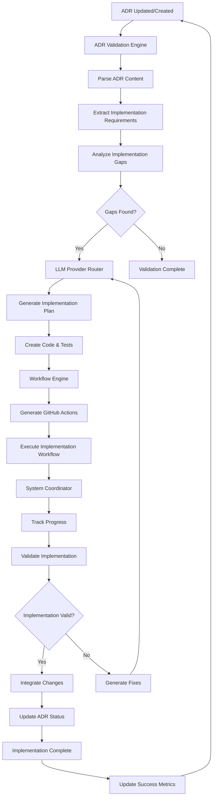

# ADR-036: ADR-Driven Testing Architecture

**Status:** Accepted  
**Date:** 2024-12-14  
**Deciders:** CLOI Development Team  
**Technical Story:** [Architecture Governance - Executable Documentation System]

## Context and Problem Statement

The CLOI system has evolved to include 17+ comprehensive Architectural Decision Records (ADRs) that document critical architectural decisions using Domain-Driven Design principles. However, these ADRs exist as static documentation with no automated mechanism to validate that the actual system implementation remains aligned with documented architectural decisions. This creates architectural drift risk where the codebase gradually deviates from documented decisions without detection.

**EVOLUTION: Self-Implementing Architecture**

Building on the portable workflow research findings, CLOI must evolve beyond validation into a **self-implementing AI development platform**. ADRs should not only validate compliance but also serve as executable specifications that enable CLOI to autonomously implement its own features.

The system requires a dynamic architecture governance mechanism that:
1. Transforms static ADRs into executable specifications
2. Validates system compliance continuously  
3. **Detects implementation gaps** between ADR specifications and current code
4. **Generates implementation plans** using AI-powered analysis
5. **Orchestrates autonomous feature development** via GitHub Actions workflows
6. **Validates and integrates** implementations automatically

This creates a self-improving development cycle where architectural decisions become actionable implementation plans, enabling CLOI to implement 80% of its roadmap autonomously while maintaining architectural integrity.

### Domain-Driven Design Context

**Bounded Context:** Architecture Governance Domain  
**Aggregate Root:** ADR Validation Engine  
**Domain Language:** Architectural Constraints, Compliance Rules, Validation Specifications, Conformance Testing, Auto-Repair  
**Core Domain Events:** ADR Parsed, Constraint Violated, Compliance Validated, Auto-Repair Triggered, Architecture Aligned

## Decision Drivers

### Domain-Driven Considerations
- **Aggregate Consistency:** Architecture specifications must remain synchronized with implementation reality
- **Ubiquitous Language:** Clear terminology for architecture validation and governance concepts
- **Bounded Context Integrity:** Architecture governance domain shouldn't pollute implementation domains
- **Domain Service Reliability:** Predictable validation and auto-repair capabilities across all system components

### Technical Requirements
- **Executable Documentation:** Transform static ADRs into machine-readable validation specifications
- **Continuous Validation:** Automated testing of architectural constraints during CI/CD workflows
- **Auto-Repair Integration:** Seamless integration with existing cloi-auto-repair.yml workflow capabilities
- **Compliance Reporting:** Clear visibility into architectural compliance status and violation patterns
- **Incremental Implementation:** Gradual enhancement of existing ADRs without disrupting current documentation

## Considered Options

### Option 1: Manual Architecture Reviews
- **Domain Impact:** Limited aggregate consistency due to human-only validation
- **Technical:** Periodic manual reviews of architecture compliance
- **Pros:** Simple implementation, human insight, flexible interpretation
- **Cons:** Slow feedback loops, inconsistent enforcement, no automation, scalability limitations

### Option 2: External Architecture Governance Tools
- **Domain Impact:** Violates bounded context with external dependency and alien domain language
- **Technical:** Integrate external tools like ArchUnit, SonarQube Architecture Rules
- **Pros:** Proven validation capabilities, established patterns
- **Cons:** Domain boundary violation, tool-specific constraints, integration complexity, limited customization

### Option 3: ADR-Driven Testing Engine ⭐ (Chosen)
- **Domain Impact:** Rich aggregate with comprehensive validation and auto-repair capabilities
- **Technical:** Native integration with existing ADR documentation and CLOI infrastructure
- **Pros:** Perfect domain alignment, leverages existing infrastructure, incremental implementation
- **Cons:** Custom development required, initial complexity

## Decision Outcome

**Chosen Option:** ADR-Driven Testing Engine with Integrated Auto-Repair

### Self-Implementing Architecture Domain

```
Architecture Governance Domain (Self-Implementing)
├── ADR Validation Engine (Aggregate Root) ⭐ Enhanced
│   ├── ADR Parser (Entity)
│   ├── Constraint Extractor (Entity)
│   ├── Implementation Gap Analyzer (Entity) 🆕
│   ├── Feature Requirements Extractor (Entity) 🆕
│   ├── Validation Orchestrator (Entity)
│   └── Compliance Reporter (Entity)
├── LLM Provider Router (Aggregate Root) ⭐ Enhanced
│   ├── Code Generation Engine (Entity) 🆕
│   ├── Architectural Pattern Analyzer (Entity) 🆕
│   ├── Context Builder (Entity) 🆕
│   └── Implementation Strategy Generator (Entity) 🆕
├── Workflow Engine (Aggregate Root) ⭐ Enhanced
│   ├── GitHub Actions Generator (Entity) 🆕
│   ├── Implementation Orchestrator (Entity) 🆕
│   ├── Workflow State Manager (Entity)
│   └── Rollback Coordinator (Entity)
├── System Coordinator (Aggregate Root) ⭐ Enhanced
│   ├── Implementation Progress Tracker (Entity) 🆕
│   ├── Autonomous Development Coordinator (Entity) 🆕
│   ├── Plugin Manager (Entity)
│   └── Configuration Manager (Entity)
├── Implementation Specifications (Value Objects) 🆕
│   ├── Implementation Gaps
│   ├── Feature Requirements
│   ├── Code Generation Context
│   ├── Workflow Definitions
│   └── Progress Metrics
├── Validation Specifications (Value Objects)
│   ├── File Structure Rules
│   ├── Dependency Constraints
│   ├── Naming Conventions
│   ├── API Contract Rules
│   └── Configuration Schemas
└── Self-Implementation Services (Domain Services) 🆕
    ├── Gap Detection Service
    ├── AI Code Generation Service
    ├── Workflow Generation Service
    ├── Implementation Validation Service
    └── Autonomous Coordination Service
```

### Self-Implementing Cycle Architecture

The enhanced architecture creates a continuous self-improvement cycle where ADRs drive autonomous feature implementation:



### 4-Tool Foundation Integration

1. **ADR Validation Engine** (`scripts/validate-adr-compliance.js`)
   - Scans ADRs for implementation gaps
   - Extracts feature requirements and specifications
   - Validates implementations against ADR constraints

2. **LLM Provider Router** (`src/core/executor/router.js`)
   - Generates implementation code using AI
   - Applies architectural patterns and best practices
   - Creates comprehensive test suites and documentation

3. **Workflow Engine** (`src/core/workflow-engine/index.js`)
   - Generates GitHub Actions workflows for implementation
   - Orchestrates complex multi-step implementations
   - Manages rollback and error recovery

4. **System Coordinator** (`src/core/coordinator/index.js`)
   - Coordinates the entire self-implementing cycle
   - Tracks implementation progress and metrics
   - Manages system state during autonomous development

### Technical Implementation

```javascript
// Domain: Architecture Governance (Self-Implementing)
// Aggregate: ADR Validation Engine (Enhanced)
class ADRValidationEngine {
  constructor() {
    this.adrParser = new ADRParsingService();
    this.constraintExtractor = new ConstraintExtractionService();
    this.implementationGapAnalyzer = new ImplementationGapAnalyzer(); // 🆕
    this.featureRequirementsExtractor = new FeatureRequirementsExtractor(); // 🆕
    this.validationOrchestrator = new ValidationOrchestrator();
    this.autoRepairService = new AutoRepairCoordinationService();
  }

  async validateArchitecture(adrDirectory, codebaseRoot) {
    // Domain Event: ADR Parsing Started
    const adrs = await this.adrParser.parseADRDirectory(adrDirectory);
    
    // Extract executable constraints from ADRs
    const constraints = await this.constraintExtractor.extractConstraints(adrs);
    
    // Domain Event: Architecture Validation Started
    const validationResults = await this.validationOrchestrator.validateConstraints(
      constraints, 
      codebaseRoot
    );
    
    // Process violations and trigger auto-repair if needed
    if (validationResults.hasViolations()) {
      // Domain Event: Constraint Violated
      await this.handleViolations(validationResults);
    }
    
    // Domain Event: Compliance Validated
    return this.generateComplianceReport(validationResults);
  }

  // 🆕 Self-Implementing Enhancement
  async analyzeImplementationGaps(adrDirectory, codebaseRoot) {
    // Domain Event: Implementation Gap Analysis Started
    const adrs = await this.adrParser.parseADRDirectory(adrDirectory);
    
    // Extract implementation requirements from ADRs
    const implementationRequirements = [];
    for (const adr of adrs) {
      const requirements = await this.featureRequirementsExtractor.extract(adr);
      if (requirements) {
        implementationRequirements.push({
          adrId: adr.id,
          title: adr.title,
          requirements
        });
      }
    }
    
    // Analyze implementation gaps
    const implementationGaps = [];
    for (const req of implementationRequirements) {
      const gaps = await this.implementationGapAnalyzer.analyze(req, codebaseRoot);
      if (gaps.length > 0) {
        implementationGaps.push({
          adrId: req.adrId,
          title: req.title,
          gaps,
          priority: this.calculateImplementationPriority(gaps),
          estimatedEffort: this.estimateImplementationEffort(gaps)
        });
      }
    }
    
    // Domain Event: Implementation Gaps Detected
    return this.prioritizeImplementationTasks(implementationGaps);
  }

  async handleViolations(validationResults) {
    const repairableViolations = validationResults.getRepairableViolations();
    
    for (const violation of repairableViolations) {
      try {
        // Domain Event: Auto-Repair Triggered
        await this.autoRepairService.repairViolation(violation);
        
        // Domain Event: Architecture Aligned
        await this.validateRepair(violation);
        
      } catch (error) {
        await this.escalateViolation(violation, error);
      }
    }
  }
}

// Domain Service: ADR Parsing with Metadata Extraction
class ADRParsingService {
  async parseADRDirectory(directory) {
    const adrFiles = await this.discoverADRFiles(directory);
    const parsedADRs = [];
    
    for (const file of adrFiles) {
      const adr = await this.parseADRFile(file);
      
      // Extract validation metadata from ADR
      const validationMetadata = await this.extractValidationMetadata(adr);
      
      if (validationMetadata) {
        adr.executableConstraints = validationMetadata;
        parsedADRs.push(adr);
      }
    }
    
    return parsedADRs;
  }

  async extractValidationMetadata(adr) {
    // Parse YAML frontmatter or structured sections for executable rules
    const metadata = {
      constraints: [],
      autoRepairRules: [],
      validationScripts: [],
      complianceTests: []
    };
    
    // Example: ADR-003 CLI Entry Point validation
    if (adr.id === 'ADR-003') {
      metadata.constraints.push({
        type: 'file-structure',
        rule: 'cli-modules-must-use-index-js',
        pattern: 'src/cli/**/index.js',
        violation: 'cli-module-without-index-js'
      });
      
      metadata.autoRepairRules.push({
        violation: 'unified-js-reference',
        action: 'update-import-path',
        from: 'src/cli/unified.js',
        to: 'src/cli/index.js'
      });
    }
    
    return metadata;
  }
}

// Domain Service: Architecture Validation
class ValidationOrchestrator {
  async validateConstraints(constraints, codebaseRoot) {
    const validationResults = new ValidationResults();
    
    for (const constraint of constraints) {
      const result = await this.validateConstraint(constraint, codebaseRoot);
      validationResults.addResult(result);
    }
    
    return validationResults;
  }

  async validateConstraint(constraint, codebaseRoot) {
    switch (constraint.type) {
      case 'file-structure':
        return await this.validateFileStructure(constraint, codebaseRoot);
      case 'dependency-pattern':
        return await this.validateDependencyPattern(constraint, codebaseRoot);
      case 'naming-convention':
        return await this.validateNamingConvention(constraint, codebaseRoot);
      case 'api-contract':
        return await this.validateAPIContract(constraint, codebaseRoot);
      default:
        throw new UnknownConstraintTypeError(constraint.type);
    }
  }

  async validateFileStructure(constraint, codebaseRoot) {
    // Example: Validate CLI modules use index.js entry points
    if (constraint.rule === 'cli-modules-must-use-index-js') {
      const cliModules = await this.findCLIModules(codebaseRoot);
      const violations = [];
      
      for (const module of cliModules) {
        const hasIndexJs = await this.fileExists(path.join(module, 'index.js'));
        if (!hasIndexJs) {
          violations.push({
            type: 'missing-index-js',
            module: module,
            severity: 'error',
            autoRepairable: true
          });
        }
      }
      
      return new ValidationResult(constraint, violations);
    }
  }
}
```

### Enhanced ADR Metadata Schema (Self-Implementing)

```yaml
# Example: Enhanced ADR-003 with validation + implementation metadata
---
adr_id: "ADR-003"
title: "CLI Entry Point Standardization"
validation_metadata:
  constraints:
    - type: "file-structure"
      rule: "cli-modules-must-use-index-js"
      description: "All CLI modules must use index.js as entry point"
      pattern: "src/cli/**/index.js"
      severity: "error"
      auto_repairable: true
      
    - type: "import-pattern"
      rule: "no-unified-js-imports"
      description: "No imports should reference deprecated unified.js"
      pattern: "import.*unified\\.js"
      severity: "error"
      auto_repairable: true
      
  validation_scripts:
    - name: "validate-cli-entry-points"
      script: "scripts/validate-cli-entry-points.js"
      
  auto_repair_rules:
    - violation: "unified-js-reference"
      action: "update-import-path"
      from_pattern: "src/cli/unified.js"
      to_pattern: "src/cli/index.js"
      
  compliance_tests:
    - test: "CLI modules have index.js entry points"
      command: "find src/cli -type d -not -path '*/.*' -exec test -f {}/index.js \\;"

# 🆕 Self-Implementation Metadata
implementation_metadata:
  feature_requirements:
    - name: "Enhanced CLI Entry Point Detection"
      description: "Improve CLI module detection to handle npm symlinks"
      complexity: "medium"
      estimated_effort: "4-6 hours"
      dependencies: ["ADR-001"]
      
    - name: "Bulk Import Path Updates"
      description: "Create automated system for bulk import path updates"
      complexity: "low"
      estimated_effort: "2-3 hours"
      dependencies: []
      
  implementation_strategy:
    approach: "incremental"
    test_driven: true
    rollback_required: true
    integration_points:
      - "src/cli/index.js"
      - "bin/index.js"
      - "scripts/validate-adr-compliance.js"
      
  ai_generation_context:
    code_patterns:
      - "Node.js module detection"
      - "Import path transformation"
      - "Symlink resolution"
    architectural_constraints:
      - "Maintain backward compatibility"
      - "Follow existing error handling patterns"
      - "Use existing logging infrastructure"
    reference_implementations:
      - "src/core/plugin-manager/index.js"
      - "src/utils/projectUtils.js"
      
  workflow_generation:
    github_actions_template: "cli-refactoring"
    test_strategy: "unit-integration-e2e"
    deployment_approach: "staged"
    rollback_triggers:
      - "test_failure_rate > 5%"
      - "manual_intervention_required"
      
  success_criteria:
    - "All CLI modules use index.js entry points"
    - "No references to deprecated unified.js"
    - "npm symlink detection works correctly"
    - "Zero breaking changes for existing users"
    - "Implementation time < 8 hours"
---
```

### Implementation Phases

#### Phase 1: Enhanced Foundation (Weeks 1-2)
- **ADR Validation Engine Enhancement**
  - Add implementation gap detection capabilities
  - Extend ADR parsing to extract implementation metadata
  - Create feature requirements extraction system

- **LLM Provider Router Enhancement**
  - Add code generation capabilities with architectural pattern awareness
  - Implement context building for AI-powered implementation
  - Create validation for generated code quality

#### Phase 2: Workflow Integration (Weeks 3-4)
- **Workflow Engine Enhancement**
  - Add GitHub Actions workflow generation
  - Implement implementation orchestration workflows
  - Create rollback and error recovery mechanisms

- **System Coordinator Enhancement**
  - Add implementation progress tracking
  - Create autonomous development coordination
  - Implement success metrics collection

#### Phase 3: Production Deployment (Weeks 5-6)
- **Self-Implementing Workflows**
  - Deploy production GitHub Actions for autonomous implementation
  - Create comprehensive monitoring and alerting
  - Establish manual intervention protocols

- **Success Validation**
  - Target: 80% autonomous implementation success rate
  - Target: <48 hours from ADR to working implementation
  - Target: 100% architectural compliance validation

### Domain Benefits

1. **Enhanced Domain Clarity**
   - Clear separation between architecture specification and validation logic
   - Ubiquitous language for architecture governance concepts
   - Well-defined aggregate boundaries for validation state management

2. **Improved Aggregate Consistency**
   - Continuous synchronization between documented decisions and implementation
   - Automated detection and correction of architectural drift
   - Reliable enforcement of architectural constraints across all domains

3. **Better Domain Service Integration**
   - Seamless integration with existing workflow engine for orchestration
   - Clean interfaces with auto-repair system for violation remediation
   - Efficient collaboration with CI/CD pipelines for continuous validation

4. **Robust Governance Automation**
   - Comprehensive validation of architectural constraints
   - Intelligent auto-repair capabilities with rollback support
   - Detailed compliance reporting and trend analysis

## Implementation Strategy

### Phase 1: ADR Parser and Constraint Extraction
```javascript
// Foundation: Parse existing ADRs and extract constraints
class Phase1Implementation {
  async initializeADRParser() {
    // Implement basic ADR parsing with YAML frontmatter support
    await this.setupConstraintExtraction();
    
    // Enhanced 3 priority ADRs with validation metadata
    await this.enhanceADR003(); // CLI Entry Point Standardization
    await this.enhanceADR002(); // A2A Protocol Integration
    await this.enhanceADR012(); // Workflow Engine Architecture
  }
}
```

### Phase 2: Validation Engine Integration
```javascript
// Core: Implement validation engine with auto-repair
class Phase2Implementation {
  async deployValidationEngine() {
    // Integrate with existing workflow engine
    await this.integrateWithWorkflowEngine();
    
    // Enhance cloi-auto-repair.yml with ADR compliance checking
    await this.enhanceAutoRepairWorkflow();
    
    // Implement basic file structure and import pattern validation
    await this.implementBasicValidators();
  }
}
```

### Phase 3: Advanced Governance Features
```javascript
// Advanced: Full governance automation with reporting
class Phase3Implementation {
  async deployAdvancedGovernance() {
    // Comprehensive constraint validation across all ADRs
    await this.enhanceAllADRs();
    
    // Advanced auto-repair with rollback capabilities
    await this.implementAdvancedAutoRepair();
    
    // Compliance dashboard and trend analysis
    await this.deployComplianceDashboard();
  }
}
```

### Integration with Existing Infrastructure

The ADR-driven testing system leverages CLOI's existing robust infrastructure:

1. **Workflow Engine Integration**: Utilizes the 746-line workflow engine with AI-powered orchestration for validation workflows
2. **Auto-Repair Enhancement**: Extends the comprehensive cloi-auto-repair.yml with ADR compliance scenarios
3. **CI/CD Pipeline Integration**: Seamless integration with existing GitHub Actions workflows
4. **Plugin System Compatibility**: Respects existing plugin architecture and validation patterns
5. **Ollama AI Integration**: Leverages local LLM capabilities for privacy-first AI-powered violation analysis and repair suggestions

## Risks and Mitigation

### Technical Risks
- **Metadata Complexity**: Risk of overly complex validation metadata
  - *Mitigation*: Start with simple constraints, evolve incrementally
- **Performance Impact**: Validation overhead in CI/CD pipelines
  - *Mitigation*: Incremental validation, caching, parallel execution

### Domain Risks
- **Bounded Context Pollution**: Risk of governance domain affecting implementation domains
  - *Mitigation*: Clear domain boundaries, read-only validation approach
- **Ubiquitous Language Drift**: Risk of validation terminology diverging from domain language
  - *Mitigation*: Regular domain language review, consistent terminology enforcement

## Consequences

### Positive Consequences
- **Continuous Architecture Alignment**: Automated validation ensures implementation matches documented decisions
- **Reduced Technical Debt**: Proactive detection and correction of architectural violations
- **Enhanced Team Coordination**: Clear, validated architectural constraints reduce confusion
- **Improved System Quality**: Consistent enforcement of architectural best practices

### Negative Consequences
- **Initial Complexity**: Additional metadata and validation logic required
- **Learning Curve**: Team needs to understand validation metadata concepts
- **Maintenance Overhead**: ADRs require more careful maintenance with executable constraints

### Neutral Consequences
- **Documentation Evolution**: ADRs become living, executable specifications rather than static documents
- **Testing Integration**: Architecture validation becomes part of standard testing practices

## Security and Governance Framework

### Integration with Security Architecture (ADR-041)
The self-implementing system includes comprehensive security validation:
- **Multi-stage security validation** for all generated code
- **Sandbox execution environments** for safe autonomous development
- **Security pattern analysis** to prevent malicious code generation
- **Privacy-first validation** maintaining local-only security processing

### Quality Governance Integration (ADR-042)
All autonomous implementations undergo rigorous quality validation:
- **Architectural compliance validation** against established ADR patterns
- **Multi-dimensional quality assessment** including code standards, test coverage, and performance
- **Quality gate enforcement** with automatic improvement recommendations
- **Comprehensive quality metrics** for continuous improvement

### Human Oversight Framework (ADR-043)
The dual-mode approach ensures appropriate human control:
- **Local Interactive Mode**: Real-time user choice with immediate oversight
- **GitHub Actions Mode**: Asynchronous review via pull requests with expert assignment
- **Intelligent escalation triggers** for complex or high-risk implementations
- **Context preservation** across all oversight handoffs

## Future Enhancements

1. **Enhanced Ollama Integration**: 
   - Custom fine-tuned models for CLOI-specific architectural patterns
   - Multi-model validation using different specialized models
   - Modern embedding models (nomic-ai/CodeRankEmbed, jinaai/jina-code-v2) for architectural pattern recognition with 77.9 MRR performance
2. **Cross-ADR Constraint Validation**: Validation of constraints spanning multiple ADRs
3. **Architecture Evolution Tracking**: Automated analysis of architectural change patterns using local LLMs
4. **Stakeholder Dashboard**: Real-time architecture compliance visibility with AI-generated insights
5. **Privacy-First AI Analytics**: Local processing of architectural metrics without external data transmission
6. **Predictive Implementation**: AI-powered prediction of implementation needs based on ADR evolution
7. **Cross-Repository Self-Implementation**: Coordinate implementations across multiple CLOI-based projects

---

*This ADR follows Domain-Driven Design principles and integrates with CLOI's existing Architecture Governance Domain to ensure continuous alignment between documented architectural decisions and actual system implementation.* 