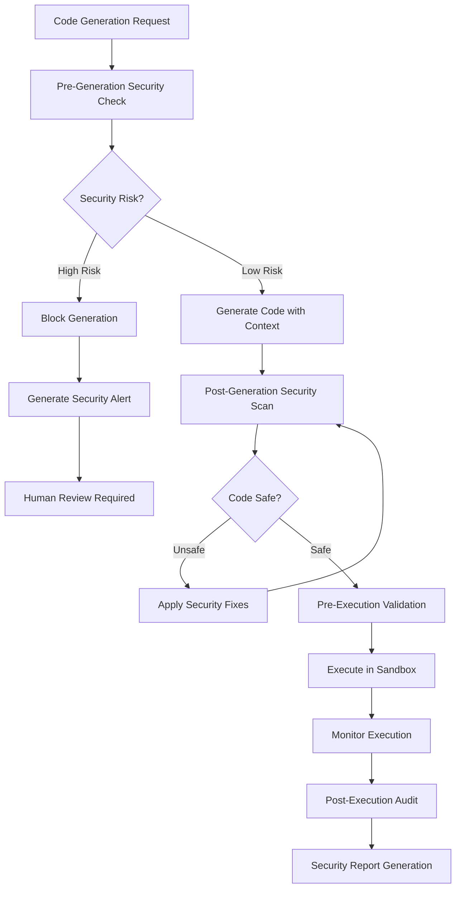

# ADR-041: Self-Implementation Security Architecture

**Status:** Accepted  
**Date:** 2024-12-29  
**Deciders:** CLOI Development Team  
**Technical Story:** [Architecture Governance - Autonomous Development Security]

## Context and Problem Statement

As CLOI evolves into a self-implementing AI development platform capable of autonomously generating and executing code based on ADR specifications, critical security considerations must be addressed. The system will generate, validate, and execute code without direct human oversight in GitHub Actions workflows, creating potential attack vectors and safety risks.

The dual-mode implementation approach (local interactive vs. autonomous GitHub Actions) requires different security models:
- **Local Mode**: Interactive user control with immediate choice and oversight
- **GitHub Actions Mode**: Autonomous execution with deferred human review via pull requests

### Domain-Driven Design Context

**Bounded Context:** Security Governance Domain  
**Aggregate Root:** Security Validation Engine  
**Domain Language:** Security Boundaries, Code Sandboxing, Validation Gates, Threat Assessment, Safe Execution  
**Core Domain Events:** Code Generated, Security Validated, Sandbox Created, Threat Detected, Safe Execution Verified

## Decision Drivers

### Security Requirements
- **Code Generation Safety**: Ensure AI-generated code cannot contain malicious patterns
- **Execution Isolation**: Prevent autonomous code execution from affecting system security
- **Data Protection**: Maintain privacy-first approach with no sensitive data exposure
- **Supply Chain Security**: Validate generated dependencies and imports
- **Rollback Safety**: Ensure all autonomous changes can be safely reverted

### Dual-Mode Security Considerations
- **Local Mode**: Interactive validation with user-controlled execution gates
- **GitHub Actions Mode**: Automated validation with comprehensive security scanning
- **Consistent Security**: Same security standards across both execution contexts

## Considered Options

### Option 1: Minimal Security (High Risk)
- Basic input validation only
- **Pros:** Simple implementation, low overhead
- **Cons:** High security risk, potential for malicious code generation

### Option 2: External Security Tools Integration
- Integrate CodeQL, SonarCloud, external scanners
- **Pros:** Proven security capabilities
- **Cons:** External dependencies, privacy concerns, integration complexity

### Option 3: Native Security Validation Engine ⭐ (Chosen)
- Built-in security validation with privacy-first design
- **Pros:** Complete control, privacy preservation, CLOI-specific patterns
- **Cons:** Custom development required, comprehensive implementation needed

## Decision Outcome

**Chosen Option:** Native Security Validation Engine with Dual-Mode Support

### Security Architecture

```
Security Governance Domain
├── Security Validation Engine (Aggregate Root)
│   ├── Code Pattern Analyzer (Entity)
│   ├── Dependency Validator (Entity)
│   ├── Execution Sandbox Manager (Entity)
│   ├── Threat Detection Service (Entity)
│   └── Security Reporter (Entity)
├── Validation Gate Orchestrator (Aggregate Root)
│   ├── Pre-Generation Validator (Entity)
│   ├── Post-Generation Validator (Entity)
│   ├── Pre-Execution Validator (Entity)
│   └── Post-Execution Validator (Entity)
├── Sandbox Environment Manager (Aggregate Root)
│   ├── Isolated Execution Context (Entity)
│   ├── Resource Limiter (Entity)
│   ├── File System Isolator (Entity)
│   └── Network Isolator (Entity)
└── Security Value Objects
    ├── Security Constraints
    ├── Threat Signatures
    ├── Safe Code Patterns
    ├── Validation Results
    └── Security Metrics
```

### Multi-Stage Security Validation



### Technical Implementation

```javascript
// Domain: Security Governance
// Aggregate: Security Validation Engine
class SecurityValidationEngine {
  constructor() {
    this.codePatternAnalyzer = new CodePatternAnalyzer();
    this.dependencyValidator = new DependencyValidator();
    this.sandboxManager = new ExecutionSandboxManager();
    this.threatDetectionService = new ThreatDetectionService();
    this.securityReporter = new SecurityReporter();
  }

  async validateCodeGeneration(generationRequest, context) {
    // Pre-generation security validation
    const preValidation = await this.preGenerationValidation(generationRequest);
    if (preValidation.hasHighRiskPatterns()) {
      throw new SecurityViolationError('High-risk code generation patterns detected');
    }

    return {
      approved: preValidation.isApproved(),
      constraints: preValidation.getSecurityConstraints(),
      monitoring: preValidation.getMonitoringRequirements()
    };
  }

  async validateGeneratedCode(code, metadata) {
    // Multi-stage security validation
    const validationResults = {
      patterns: await this.codePatternAnalyzer.analyze(code),
      dependencies: await this.dependencyValidator.validate(code),
      threats: await this.threatDetectionService.scan(code),
      execution: await this.validateExecutionSafety(code)
    };

    // Generate security score
    const securityScore = this.calculateSecurityScore(validationResults);
    
    if (securityScore < this.getMinimumSecurityThreshold()) {
      return this.generateSecurityFixRecommendations(validationResults);
    }

    return {
      approved: true,
      securityScore,
      validationResults,
      sandbox: await this.sandboxManager.prepareSandbox(code, metadata)
    };
  }

  async executeInSandbox(code, sandbox, context) {
    try {
      // Create isolated execution environment
      const isolatedContext = await this.sandboxManager.createIsolatedContext(sandbox);
      
      // Monitor execution with security constraints
      const executionMonitor = new SecurityExecutionMonitor(isolatedContext);
      
      // Execute with resource and security limits
      const result = await executionMonitor.executeWithLimits(code, {
        timeLimit: context.executionTimeout || 30000,
        memoryLimit: context.memoryLimit || '512MB',
        fileSystemAccess: context.fileSystemAccess || 'read-only',
        networkAccess: context.networkAccess || 'none'
      });

      // Post-execution security audit
      const auditResults = await this.auditExecution(result, isolatedContext);
      
      return {
        success: true,
        result,
        auditResults,
        securityMetrics: executionMonitor.getSecurityMetrics()
      };
      
    } catch (error) {
      // Security incident response
      await this.handleSecurityIncident(error, sandbox, context);
      throw error;
    } finally {
      // Always cleanup sandbox
      await this.sandboxManager.cleanupSandbox(sandbox);
    }
  }
}

// Security Pattern Analysis
class CodePatternAnalyzer {
  constructor() {
    this.dangerousPatterns = [
      // Command injection patterns
      /exec\s*\(/g,
      /spawn\s*\(/g,
      /eval\s*\(/g,
      /Function\s*\(/g,
      
      // File system access patterns
      /fs\.writeFile|fs\.writeFileSync/g,
      /fs\.unlink|fs\.unlinkSync/g,
      /fs\.rmdir|fs\.rmdirSync/g,
      
      // Network access patterns
      /require\(['"]http['"]\)/g,
      /require\(['"]https['"]\)/g,
      /require\(['"]net['"]\)/g,
      
      // Environment variable access
      /process\.env\[/g,
      
      // Dynamic imports
      /import\s*\(/g,
      /require\s*\(\s*[^'"]/g
    ];

    this.suspiciousPatterns = [
      // Obfuscation patterns
      /String\.fromCharCode/g,
      /atob\s*\(/g,
      /btoa\s*\(/g,
      
      // Reflection patterns
      /\[\s*['"][a-zA-Z_$][a-zA-Z0-9_$]*['"]\s*\]/g,
      
      // Constructor access
      /constructor\s*\[/g
    ];
  }

  async analyze(code) {
    const dangerousMatches = this.findPatternMatches(code, this.dangerousPatterns);
    const suspiciousMatches = this.findPatternMatches(code, this.suspiciousPatterns);
    
    return {
      dangerousPatterns: dangerousMatches,
      suspiciousPatterns: suspiciousMatches,
      riskLevel: this.calculateRiskLevel(dangerousMatches, suspiciousMatches),
      recommendations: this.generateSecurityRecommendations(dangerousMatches, suspiciousMatches)
    };
  }

  calculateRiskLevel(dangerous, suspicious) {
    if (dangerous.length > 0) return 'HIGH';
    if (suspicious.length > 3) return 'MEDIUM';
    if (suspicious.length > 0) return 'LOW';
    return 'SAFE';
  }
}

// Dependency Security Validation
class DependencyValidator {
  constructor() {
    this.trustedPackages = new Set([
      '@anthropic/cloi-core',
      'lodash',
      'express',
      'axios',
      // Core Node.js modules are implicitly trusted
    ]);

    this.blockedPackages = new Set([
      'eval',
      'vm2',
      'node-pty',
      // Known vulnerable or dangerous packages
    ]);
  }

  async validate(code) {
    const dependencies = this.extractDependencies(code);
    const validationResults = [];

    for (const dep of dependencies) {
      const result = await this.validateDependency(dep);
      validationResults.push(result);
    }

    return {
      dependencies,
      results: validationResults,
      hasBlockedDependencies: validationResults.some(r => r.blocked),
      hasUntrustedDependencies: validationResults.some(r => !r.trusted && !r.blocked)
    };
  }

  extractDependencies(code) {
    const requirePattern = /require\s*\(['"]([^'"]+)['"]\)/g;
    const importPattern = /import\s+.*\s+from\s+['"]([^'"]+)['"]/g;
    
    const dependencies = new Set();
    
    let match;
    while ((match = requirePattern.exec(code)) !== null) {
      dependencies.add(match[1]);
    }
    
    while ((match = importPattern.exec(code)) !== null) {
      dependencies.add(match[1]);
    }
    
    return Array.from(dependencies);
  }

  async validateDependency(dependency) {
    // Check if blocked
    if (this.blockedPackages.has(dependency)) {
      return {
        dependency,
        blocked: true,
        reason: 'Package is on security blocklist',
        trusted: false
      };
    }

    // Check if trusted
    if (this.trustedPackages.has(dependency) || this.isNodeCoreModule(dependency)) {
      return {
        dependency,
        blocked: false,
        trusted: true,
        reason: 'Package is on trusted list or Node.js core module'
      };
    }

    // Unknown package - requires review
    return {
      dependency,
      blocked: false,
      trusted: false,
      reason: 'Unknown package requires security review',
      action: 'manual_review_required'
    };
  }

  isNodeCoreModule(dependency) {
    const coreModules = [
      'fs', 'path', 'crypto', 'util', 'os', 'url', 'querystring',
      'stream', 'events', 'buffer', 'process', 'child_process'
    ];
    return coreModules.includes(dependency);
  }
}
```

### Security Constraints Configuration

```yaml
# Security validation metadata for ADRs
security_metadata:
  code_generation_constraints:
    - type: "pattern-restriction"
      rule: "no-dynamic-execution"
      patterns: ["eval", "Function", "exec", "spawn"]
      severity: "block"
      
    - type: "dependency-restriction"
      rule: "trusted-packages-only"
      allowed_sources: ["npm-registry", "github-cloi-org"]
      blocked_packages: ["eval", "vm2", "node-pty"]
      severity: "block"
      
    - type: "file-access-restriction"
      rule: "read-only-file-system"
      allowed_operations: ["read", "list"]
      blocked_operations: ["write", "delete", "execute"]
      severity: "warning"
      
  execution_constraints:
    - type: "resource-limit"
      rule: "sandbox-resource-limits"
      limits:
        memory: "512MB"
        cpu_time: "30s"
        file_descriptors: 100
      severity: "enforce"
      
    - type: "network-isolation"
      rule: "no-external-network"
      allowed_hosts: []
      blocked_ports: "all"
      severity: "enforce"
      
  validation_gates:
    - gate: "pre-generation"
      validators: ["pattern-analysis", "context-validation"]
      threshold: "medium"
      
    - gate: "post-generation"
      validators: ["code-analysis", "dependency-check", "threat-detection"]
      threshold: "low"
      
    - gate: "pre-execution"
      validators: ["sandbox-validation", "resource-check"]
      threshold: "low"
      
    - gate: "post-execution"
      validators: ["audit-trail", "impact-assessment"]
      threshold: "low"
```

### Dual-Mode Security Implementation

#### Local Interactive Mode
```javascript
class LocalSecurityController {
  async secureCodeGeneration(request, userContext) {
    // Interactive security validation with user choice
    const securityAssessment = await this.assessSecurityRisk(request);
    
    if (securityAssessment.riskLevel === 'HIGH') {
      const userChoice = await this.promptUser({
        message: `High security risk detected: ${securityAssessment.risks.join(', ')}`,
        options: ['review-risks', 'modify-request', 'cancel']
      });
      
      if (userChoice === 'cancel') {
        return { cancelled: true, reason: 'user_security_concern' };
      }
    }
    
    // User approved - proceed with monitored execution
    return await this.executeWithUserOversight(request, securityAssessment);
  }
}
```

#### GitHub Actions Autonomous Mode
```javascript
class AutonomousSecurityController {
  async secureCodeGeneration(request, actionContext) {
    // Strict automated security validation
    const securityAssessment = await this.assessSecurityRisk(request);
    
    if (securityAssessment.riskLevel !== 'LOW') {
      // Create security review PR instead of blocking
      return await this.createSecurityReviewPR(request, securityAssessment);
    }
    
    // Low risk - proceed with autonomous execution
    return await this.executeInSecureSandbox(request, securityAssessment);
  }
  
  async createSecurityReviewPR(request, assessment) {
    const prContent = this.generateSecurityReviewContent(request, assessment);
    
    return await this.githubClient.createPR({
      title: `Security Review Required: ${request.feature}`,
      body: prContent,
      labels: ['security-review', 'human-oversight-required'],
      reviewers: ['@security-team']
    });
  }
}
```

## Implementation Strategy

### Phase 1: Core Security Infrastructure
- Implement SecurityValidationEngine with basic pattern analysis
- Create sandbox environment for isolated code execution
- Establish security constraint validation system

### Phase 2: Dual-Mode Security Controllers
- Implement LocalSecurityController for interactive mode
- Implement AutonomousSecurityController for GitHub Actions
- Create security review PR generation system

### Phase 3: Advanced Threat Detection
- Implement machine learning-based threat detection
- Create adaptive security patterns based on code patterns
- Establish security metrics and alerting system

## Security Monitoring and Alerting

```javascript
class SecurityMonitoringService {
  async monitorSecurityEvents() {
    // Real-time security event monitoring
    this.addEventListener('code-generated', this.auditCodeGeneration);
    this.addEventListener('execution-started', this.monitorExecution);
    this.addEventListener('security-violation', this.handleSecurityIncident);
  }
  
  async handleSecurityIncident(incident) {
    // Immediate response protocol
    await this.isolateAffectedSystems(incident);
    await this.notifySecurityTeam(incident);
    await this.generateIncidentReport(incident);
    
    // Adaptive security enhancement
    await this.updateSecurityPatterns(incident);
  }
}
```

## Consequences

### Positive Consequences
- **Comprehensive Security**: Multi-layered security validation protects against code generation risks
- **Privacy Preservation**: Local-first security validation maintains data privacy
- **Dual-Mode Safety**: Appropriate security measures for both interactive and autonomous modes
- **Adaptive Protection**: Security patterns evolve based on detected threats

### Security Trade-offs
- **Performance Impact**: Security validation adds overhead to code generation pipeline
- **Complexity**: Sophisticated security system requires maintenance and updates
- **False Positives**: Overly strict security may block legitimate code patterns

## Future Enhancements

1. **AI-Powered Threat Detection**: Use local LLMs for advanced threat pattern recognition
2. **Behavioral Analysis**: Monitor code execution patterns for anomaly detection
3. **Cryptographic Verification**: Sign and verify all generated code for integrity
4. **Distributed Security**: Coordinate security across multiple CLOI instances
5. **Security Analytics**: Long-term security trend analysis and pattern recognition

---

*This ADR establishes comprehensive security governance for CLOI's self-implementing capabilities while maintaining the privacy-first approach and enabling both interactive and autonomous development workflows.*