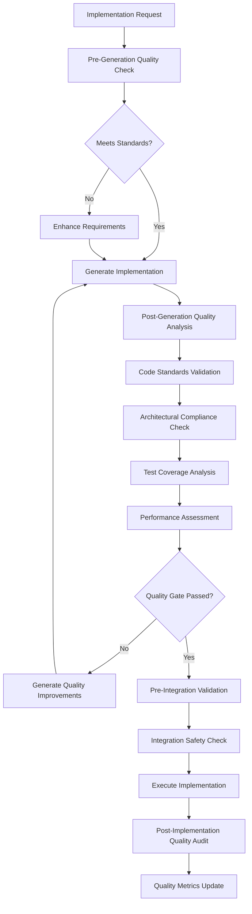

# ADR-042: Implementation Quality and Governance

**Status:** Accepted  
**Date:** 2024-12-29  
**Deciders:** CLOI Development Team  
**Technical Story:** [Architecture Governance - Autonomous Quality Assurance]

## Context and Problem Statement

CLOI's self-implementing architecture requires sophisticated quality governance to ensure autonomously generated code meets the same standards as human-written code. The system must validate architectural compliance, code quality, test coverage, and functional correctness across both local interactive development and autonomous GitHub Actions workflows.

Without comprehensive quality gates, autonomous implementation could introduce:
- Code that violates established architectural patterns
- Implementations that pass basic tests but fail edge cases
- Features that work in isolation but break system integration
- Technical debt that accumulates over autonomous development cycles

### Domain-Driven Design Context

**Bounded Context:** Quality Governance Domain  
**Aggregate Root:** Quality Validation Engine  
**Domain Language:** Quality Gates, Architectural Compliance, Test Coverage, Code Standards, Implementation Validation  
**Core Domain Events:** Implementation Analyzed, Quality Gate Passed, Compliance Validated, Test Coverage Verified, Quality Score Calculated

## Decision Drivers

### Quality Requirements
- **Architectural Compliance**: All generated code must follow established ADR patterns
- **Test Coverage**: Minimum 80% test coverage for autonomous implementations
- **Code Standards**: Consistent code style, documentation, and error handling
- **Integration Safety**: Ensure implementations don't break existing functionality
- **Performance Standards**: Generated code must meet performance benchmarks

### Governance Requirements
- **Automated Quality Assessment**: Comprehensive quality evaluation without human intervention
- **Multi-Stage Validation**: Quality gates at generation, pre-execution, and post-implementation
- **Rollback Capability**: Ability to revert implementations that fail quality standards
- **Quality Metrics**: Quantifiable measures of implementation quality and trends

## Considered Options

### Option 1: Basic Linting and Testing
- Simple ESLint, test runner, basic checks
- **Pros:** Lightweight, fast execution
- **Cons:** Limited quality coverage, no architectural validation

### Option 2: External Quality Tools Integration
- SonarQube, CodeClimate, external quality platforms
- **Pros:** Proven quality metrics, comprehensive analysis
- **Cons:** External dependencies, privacy concerns, limited customization

### Option 3: Comprehensive Native Quality Engine ⭐ (Chosen)
- Built-in quality validation with CLOI-specific patterns
- **Pros:** Complete control, privacy preservation, architectural awareness
- **Cons:** Custom development required, comprehensive implementation needed

## Decision Outcome

**Chosen Option:** Comprehensive Native Quality Engine with Multi-Stage Validation

### Quality Governance Architecture

```
Quality Governance Domain
├── Quality Validation Engine (Aggregate Root)
│   ├── Architectural Compliance Validator (Entity)
│   ├── Code Standards Analyzer (Entity)
│   ├── Test Coverage Validator (Entity)
│   ├── Performance Analyzer (Entity)
│   └── Integration Safety Checker (Entity)
├── Quality Gate Orchestrator (Aggregate Root)
│   ├── Pre-Generation Quality Gate (Entity)
│   ├── Post-Generation Quality Gate (Entity)
│   ├── Pre-Integration Quality Gate (Entity)
│   └── Post-Implementation Quality Gate (Entity)
├── Quality Metrics Engine (Aggregate Root)
│   ├── Quality Score Calculator (Entity)
│   ├── Trend Analyzer (Entity)
│   ├── Benchmark Comparator (Entity)
│   └── Quality Reporter (Entity)
└── Quality Value Objects
    ├── Quality Standards
    ├── Compliance Rules
    ├── Test Requirements
    ├── Performance Benchmarks
    └── Quality Scores
```

### Multi-Stage Quality Pipeline



### Technical Implementation

```javascript
// Domain: Quality Governance
// Aggregate: Quality Validation Engine
class QualityValidationEngine {
  constructor() {
    this.architecturalValidator = new ArchitecturalComplianceValidator();
    this.codeStandardsAnalyzer = new CodeStandardsAnalyzer();
    this.testCoverageValidator = new TestCoverageValidator();
    this.performanceAnalyzer = new PerformanceAnalyzer();
    this.integrationSafetyChecker = new IntegrationSafetyChecker();
    this.qualityGateOrchestrator = new QualityGateOrchestrator();
  }

  async validateImplementationQuality(implementation, context) {
    // Multi-dimensional quality analysis
    const qualityResults = {
      architectural: await this.architecturalValidator.validate(implementation, context),
      codeStandards: await this.codeStandardsAnalyzer.analyze(implementation),
      testCoverage: await this.testCoverageValidator.validate(implementation),
      performance: await this.performanceAnalyzer.analyze(implementation),
      integrationSafety: await this.integrationSafetyChecker.check(implementation, context)
    };

    // Calculate overall quality score
    const qualityScore = this.calculateQualityScore(qualityResults);
    
    // Check against quality gates
    const gateResults = await this.qualityGateOrchestrator.processQualityGates(
      qualityResults, 
      qualityScore, 
      context
    );

    return {
      passed: gateResults.allGatesPassed(),
      qualityScore,
      results: qualityResults,
      gateResults,
      recommendations: this.generateQualityRecommendations(qualityResults),
      improvements: gateResults.getRequiredImprovements()
    };
  }

  calculateQualityScore(results) {
    // Weighted quality score calculation
    const weights = {
      architectural: 0.30,    // 30% - Architecture compliance is critical
      codeStandards: 0.20,   // 20% - Code quality standards
      testCoverage: 0.25,    // 25% - Test coverage and quality
      performance: 0.15,     // 15% - Performance benchmarks
      integrationSafety: 0.10 // 10% - Integration safety
    };

    let totalScore = 0;
    let totalWeight = 0;

    for (const [dimension, result] of Object.entries(results)) {
      if (result && result.score !== undefined) {
        totalScore += result.score * weights[dimension];
        totalWeight += weights[dimension];
      }
    }

    return totalWeight > 0 ? (totalScore / totalWeight) : 0;
  }
}

// Architectural Compliance Validation
class ArchitecturalComplianceValidator {
  constructor() {
    this.adrConstraints = new Map();
    this.domainPatterns = new Map();
    this.boundaryRules = new Map();
    this.loadArchitecturalConstraints();
  }

  async validate(implementation, context) {
    const complianceResults = {
      adrCompliance: await this.validateADRCompliance(implementation, context),
      domainCompliance: await this.validateDomainCompliance(implementation),
      boundaryCompliance: await this.validateBoundaryCompliance(implementation),
      patternCompliance: await this.validatePatternCompliance(implementation)
    };

    const complianceScore = this.calculateComplianceScore(complianceResults);
    
    return {
      score: complianceScore,
      results: complianceResults,
      violations: this.extractViolations(complianceResults),
      recommendations: this.generateComplianceRecommendations(complianceResults)
    };
  }

  async validateADRCompliance(implementation, context) {
    const relevantADRs = await this.getRelevantADRs(implementation, context);
    const violations = [];

    for (const adr of relevantADRs) {
      const constraints = this.adrConstraints.get(adr.id) || [];
      
      for (const constraint of constraints) {
        const violation = await this.checkConstraint(implementation, constraint);
        if (violation) {
          violations.push({
            adrId: adr.id,
            constraint: constraint.rule,
            violation: violation.description,
            severity: constraint.severity,
            fixSuggestion: violation.fixSuggestion
          });
        }
      }
    }

    return {
      checkedADRs: relevantADRs.length,
      violations,
      complianceRate: (relevantADRs.length - violations.length) / relevantADRs.length
    };
  }

  async validateDomainCompliance(implementation) {
    // Validate Domain-Driven Design compliance
    const domainViolations = [];
    
    // Check bounded context compliance
    const boundedContextViolation = this.checkBoundedContextViolation(implementation);
    if (boundedContextViolation) {
      domainViolations.push(boundedContextViolation);
    }
    
    // Check aggregate root patterns
    const aggregateViolations = this.checkAggregatePatterns(implementation);
    domainViolations.push(...aggregateViolations);
    
    // Check domain event usage
    const eventViolations = this.checkDomainEventUsage(implementation);
    domainViolations.push(...eventViolations);

    return {
      violations: domainViolations,
      domainScore: Math.max(0, 100 - (domainViolations.length * 10))
    };
  }
}

// Code Standards Analysis
class CodeStandardsAnalyzer {
  constructor() {
    this.eslintConfig = this.loadESLintConfig();
    this.documentationStandards = this.loadDocumentationStandards();
    this.namingConventions = this.loadNamingConventions();
  }

  async analyze(implementation) {
    const analysisResults = {
      syntaxStandards: await this.analyzeSyntaxStandards(implementation),
      documentationQuality: await this.analyzeDocumentationQuality(implementation),
      namingConventions: await this.analyzeNamingConventions(implementation),
      errorHandling: await this.analyzeErrorHandling(implementation),
      codeComplexity: await this.analyzeCodeComplexity(implementation)
    };

    const codeQualityScore = this.calculateCodeQualityScore(analysisResults);

    return {
      score: codeQualityScore,
      results: analysisResults,
      issues: this.extractIssues(analysisResults),
      improvements: this.generateImprovements(analysisResults)
    };
  }

  async analyzeSyntaxStandards(implementation) {
    // Use ESLint-like analysis for syntax standards
    const syntaxIssues = [];
    
    // Check for consistent indentation
    if (!this.hasConsistentIndentation(implementation.code)) {
      syntaxIssues.push({
        type: 'indentation',
        message: 'Inconsistent indentation detected',
        severity: 'warning'
      });
    }
    
    // Check for proper semicolon usage
    if (!this.hasProperSemicolonUsage(implementation.code)) {
      syntaxIssues.push({
        type: 'semicolons',
        message: 'Inconsistent semicolon usage',
        severity: 'warning'
      });
    }
    
    // Check for unused variables
    const unusedVariables = this.findUnusedVariables(implementation.code);
    if (unusedVariables.length > 0) {
      syntaxIssues.push({
        type: 'unused-variables',
        message: `Unused variables: ${unusedVariables.join(', ')}`,
        severity: 'error'
      });
    }

    return {
      issues: syntaxIssues,
      score: Math.max(0, 100 - (syntaxIssues.length * 5))
    };
  }

  async analyzeErrorHandling(implementation) {
    const errorHandlingIssues = [];
    
    // Check for try-catch blocks around async operations
    const asyncOperations = this.findAsyncOperations(implementation.code);
    const unhandledAsync = asyncOperations.filter(op => !this.hasErrorHandling(op));
    
    if (unhandledAsync.length > 0) {
      errorHandlingIssues.push({
        type: 'unhandled-async',
        message: `${unhandledAsync.length} async operations without error handling`,
        severity: 'error',
        locations: unhandledAsync.map(op => op.location)
      });
    }
    
    // Check for proper error propagation
    const errorPropagationIssues = this.checkErrorPropagation(implementation.code);
    errorHandlingIssues.push(...errorPropagationIssues);

    return {
      issues: errorHandlingIssues,
      score: Math.max(0, 100 - (errorHandlingIssues.length * 10))
    };
  }
}

// Test Coverage Validation
class TestCoverageValidator {
  constructor() {
    this.minimumCoverage = 80; // 80% minimum coverage
    this.testPatterns = this.loadTestPatterns();
  }

  async validate(implementation) {
    const testResults = {
      unitTests: await this.validateUnitTests(implementation),
      integrationTests: await this.validateIntegrationTests(implementation),
      coverage: await this.calculateTestCoverage(implementation),
      testQuality: await this.analyzeTestQuality(implementation)
    };

    const testScore = this.calculateTestScore(testResults);

    return {
      score: testScore,
      results: testResults,
      passed: testResults.coverage.overall >= this.minimumCoverage,
      requirements: this.generateTestRequirements(testResults)
    };
  }

  async validateUnitTests(implementation) {
    const unitTestIssues = [];
    
    // Check if all public methods have unit tests
    const publicMethods = this.extractPublicMethods(implementation.code);
    const testedMethods = this.findTestedMethods(implementation.tests);
    
    const untestedMethods = publicMethods.filter(method => 
      !testedMethods.includes(method)
    );
    
    if (untestedMethods.length > 0) {
      unitTestIssues.push({
        type: 'untested-methods',
        message: `Methods without unit tests: ${untestedMethods.join(', ')}`,
        severity: 'error'
      });
    }
    
    // Check for edge case testing
    const edgeCaseTests = this.findEdgeCaseTests(implementation.tests);
    if (edgeCaseTests.length < publicMethods.length * 0.5) {
      unitTestIssues.push({
        type: 'insufficient-edge-cases',
        message: 'Insufficient edge case testing',
        severity: 'warning'
      });
    }

    return {
      issues: unitTestIssues,
      coverage: testedMethods.length / publicMethods.length,
      score: Math.max(0, 100 - (unitTestIssues.length * 15))
    };
  }

  async calculateTestCoverage(implementation) {
    // Simulate coverage calculation
    const coverageResults = {
      statements: this.calculateStatementCoverage(implementation),
      branches: this.calculateBranchCoverage(implementation),
      functions: this.calculateFunctionCoverage(implementation),
      lines: this.calculateLineCoverage(implementation)
    };

    coverageResults.overall = (
      coverageResults.statements + 
      coverageResults.branches + 
      coverageResults.functions + 
      coverageResults.lines
    ) / 4;

    return coverageResults;
  }
}
```

### Quality Standards Configuration

```yaml
# Quality governance metadata for ADRs
quality_metadata:
  architectural_standards:
    - type: "domain-compliance"
      rule: "bounded-context-isolation"
      description: "Code must respect domain boundaries"
      severity: "error"
      
    - type: "aggregate-pattern"
      rule: "proper-aggregate-usage"
      description: "Aggregates must follow DDD patterns"
      severity: "error"
      
    - type: "event-driven"
      rule: "domain-events-for-cross-domain"
      description: "Cross-domain communication via events only"
      severity: "warning"
      
  code_standards:
    - type: "documentation"
      rule: "public-api-documentation"
      description: "All public APIs must have JSDoc documentation"
      minimum_coverage: 90
      severity: "warning"
      
    - type: "error-handling"
      rule: "async-error-handling"
      description: "All async operations must have error handling"
      severity: "error"
      
    - type: "naming-conventions"
      rule: "consistent-naming"
      patterns:
        classes: "PascalCase"
        functions: "camelCase"
        constants: "UPPER_SNAKE_CASE"
      severity: "warning"
      
  test_requirements:
    - type: "coverage-minimum"
      rule: "80-percent-coverage"
      thresholds:
        statements: 80
        branches: 75
        functions: 85
        lines: 80
      severity: "error"
      
    - type: "test-patterns"
      rule: "comprehensive-test-suite"
      requirements:
        unit_tests: "all_public_methods"
        integration_tests: "critical_workflows"
        edge_case_tests: "error_conditions"
      severity: "error"
      
  performance_standards:
    - type: "response-time"
      rule: "api-response-limits"
      limits:
        sync_operations: "100ms"
        async_operations: "5s"
        batch_operations: "30s"
      severity: "warning"
      
    - type: "memory-usage"
      rule: "memory-efficiency"
      limits:
        max_heap_growth: "50MB"
        memory_leaks: "zero"
      severity: "error"
```

### Quality Gate Implementation

```javascript
class QualityGateOrchestrator {
  constructor() {
    this.gates = [
      new PreGenerationQualityGate(),
      new PostGenerationQualityGate(),
      new PreIntegrationQualityGate(),
      new PostImplementationQualityGate()
    ];
  }

  async processQualityGates(qualityResults, qualityScore, context) {
    const gateResults = [];
    
    for (const gate of this.gates) {
      if (await gate.isApplicable(context)) {
        const result = await gate.process(qualityResults, qualityScore, context);
        gateResults.push(result);
        
        // Stop processing if gate fails with blocking severity
        if (!result.passed && result.blocking) {
          break;
        }
      }
    }

    return new QualityGateResults(gateResults);
  }
}

class PostGenerationQualityGate extends QualityGate {
  async process(qualityResults, qualityScore, context) {
    const requirements = {
      minimumQualityScore: 75,
      requiredTests: true,
      architecturalCompliance: true,
      codeStandards: true
    };

    const issues = [];
    
    if (qualityScore < requirements.minimumQualityScore) {
      issues.push({
        type: 'quality-score',
        message: `Quality score ${qualityScore} below minimum ${requirements.minimumQualityScore}`,
        blocking: true
      });
    }
    
    if (!qualityResults.testCoverage.passed) {
      issues.push({
        type: 'test-coverage',
        message: 'Insufficient test coverage',
        blocking: true
      });
    }
    
    if (qualityResults.architectural.violations.length > 0) {
      issues.push({
        type: 'architectural-violations',
        message: `${qualityResults.architectural.violations.length} architectural violations`,
        blocking: qualityResults.architectural.violations.some(v => v.severity === 'error')
      });
    }

    return {
      gateName: 'post-generation',
      passed: issues.filter(i => i.blocking).length === 0,
      issues,
      blocking: issues.some(i => i.blocking),
      improvements: this.generateImprovements(issues)
    };
  }
}
```

## Implementation Strategy

### Phase 1: Core Quality Infrastructure
- Implement QualityValidationEngine with basic standards
- Create architectural compliance validation
- Establish test coverage requirements

### Phase 2: Comprehensive Quality Gates
- Implement all quality gate stages
- Create quality improvement recommendations
- Establish quality metrics tracking

### Phase 3: Advanced Quality Intelligence
- Implement adaptive quality standards
- Create quality trend analysis
- Establish benchmark comparisons

## Quality Metrics and Reporting

```javascript
class QualityMetricsEngine {
  async generateQualityReport(implementation, validationResults) {
    return {
      overall: {
        qualityScore: validationResults.qualityScore,
        grade: this.calculateQualityGrade(validationResults.qualityScore),
        trend: await this.calculateQualityTrend(implementation)
      },
      dimensions: {
        architectural: validationResults.results.architectural.score,
        codeStandards: validationResults.results.codeStandards.score,
        testCoverage: validationResults.results.testCoverage.score,
        performance: validationResults.results.performance.score,
        integrationSafety: validationResults.results.integrationSafety.score
      },
      recommendations: validationResults.recommendations,
      improvements: validationResults.improvements,
      benchmarks: await this.compareToBenchmarks(validationResults),
      timestamp: new Date().toISOString()
    };
  }
}
```

## Consequences

### Positive Consequences
- **Consistent Quality**: Autonomous implementations meet same standards as human code
- **Architectural Integrity**: Generated code follows established patterns and constraints
- **Comprehensive Validation**: Multi-dimensional quality assessment catches various issues
- **Continuous Improvement**: Quality metrics enable ongoing enhancement of standards

### Quality Trade-offs
- **Implementation Overhead**: Comprehensive quality validation adds processing time
- **Complexity**: Sophisticated quality system requires maintenance and calibration
- **False Rejections**: Overly strict standards may reject valid implementations

## Future Enhancements

1. **AI-Powered Quality Assessment**: Use LLMs for sophisticated code quality analysis
2. **Adaptive Standards**: Quality requirements that evolve based on codebase maturity
3. **Quality Prediction**: Predict quality issues before implementation generation
4. **Cross-Repository Quality**: Quality standards that span multiple projects
5. **Quality Learning**: System learns from quality patterns and improves standards

---

*This ADR establishes comprehensive quality governance for CLOI's self-implementing capabilities, ensuring autonomous implementations maintain high standards while enabling continuous quality improvement.*