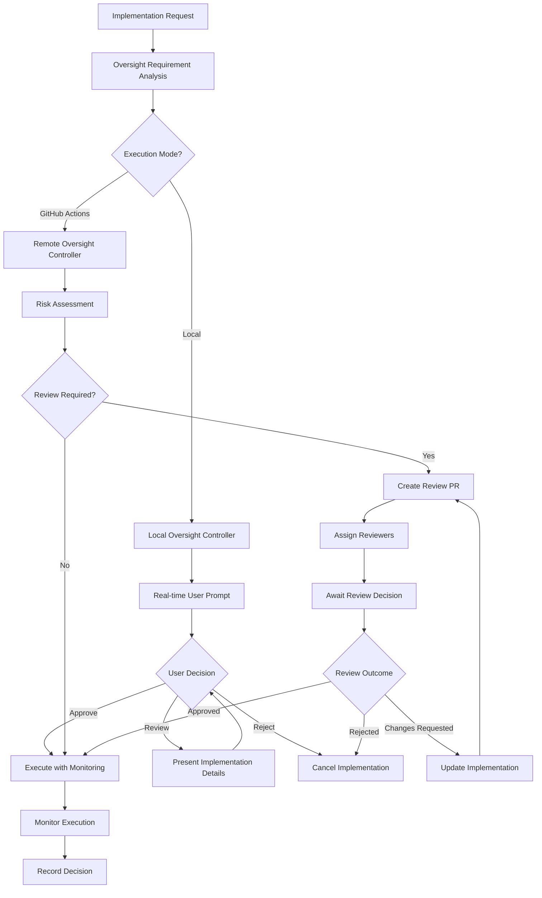

# ADR-043: Human Oversight in Autonomous Development

**Status:** Accepted  
**Date:** 2024-12-29  
**Deciders:** CLOI Development Team  
**Technical Story:** [Architecture Governance - Human-AI Collaboration Framework]

## Context and Problem Statement

CLOI's self-implementing architecture operates in two distinct modes with different human oversight requirements:

1. **Local Interactive Mode**: Direct user control with real-time choices and immediate feedback
2. **GitHub Actions Mode**: Autonomous execution with deferred human review via pull requests

The system must balance autonomous capability with appropriate human oversight to ensure:
- Critical decisions receive human judgment
- Complex implementations get proper review
- System failures trigger appropriate escalation
- User maintains agency and control over their development environment

### Dual-Mode Human Oversight Challenges

**Local Mode Challenges:**
- When to interrupt user workflow for oversight
- How to provide meaningful choice without overwhelming users
- Balancing convenience with safety and control

**GitHub Actions Mode Challenges:**
- Determining which implementations require human review
- Creating effective asynchronous review workflows
- Handling implementation failures and conflicts
- Escalating complex decisions appropriately

### Domain-Driven Design Context

**Bounded Context:** Human Oversight Domain  
**Aggregate Root:** Oversight Coordination Engine  
**Domain Language:** Human Oversight, Escalation Triggers, Review Gates, User Agency, Approval Workflows  
**Core Domain Events:** Oversight Required, Human Approval Requested, Escalation Triggered, Review Completed, Decision Recorded

## Decision Drivers

### Human-Centric Requirements
- **User Agency**: Users maintain ultimate control over their development environment
- **Informed Decisions**: Provide sufficient context for meaningful human choices
- **Workflow Integration**: Human oversight integrates smoothly with development workflows
- **Escalation Clarity**: Clear triggers and processes for when human intervention is required

### Technical Requirements
- **Context Preservation**: Maintain full context across oversight handoffs
- **Asynchronous Review**: Support both immediate and deferred review workflows
- **Decision Tracking**: Record and audit all human oversight decisions
- **Failure Recovery**: Graceful handling of review timeouts and conflicts

## Considered Options

### Option 1: Minimal Human Oversight
- Basic approval gates only for high-risk operations
- **Pros:** Maximum automation, minimal interruption
- **Cons:** Reduced user control, potential for inappropriate autonomous actions

### Option 2: Maximal Human Oversight
- Human approval required for all autonomous operations
- **Pros:** Maximum control, complete human oversight
- **Cons:** Negates automation benefits, creates workflow bottlenecks

### Option 3: Intelligent Adaptive Oversight ⭐ (Chosen)
- Context-aware human oversight with dual-mode support
- **Pros:** Balances automation with appropriate control, adapts to context
- **Cons:** Complex implementation, requires sophisticated decision logic

## Decision Outcome

**Chosen Option:** Intelligent Adaptive Oversight with Dual-Mode Implementation

### Human Oversight Architecture

```
Human Oversight Domain
├── Oversight Coordination Engine (Aggregate Root)
│   ├── Local Oversight Controller (Entity)
│   ├── Remote Oversight Controller (Entity)
│   ├── Escalation Manager (Entity)
│   ├── Context Preservor (Entity)
│   └── Decision Tracker (Entity)
├── Review Workflow Engine (Aggregate Root)
│   ├── Review Request Generator (Entity)
│   ├── Approval Workflow Orchestrator (Entity)
│   ├── Review Assignment Engine (Entity)
│   └── Review Status Monitor (Entity)
├── Decision Intelligence Engine (Aggregate Root)
│   ├── Oversight Requirement Analyzer (Entity)
│   ├── Risk Assessment Engine (Entity)
│   ├── Complexity Evaluator (Entity)
│   └── Escalation Trigger Evaluator (Entity)
└── Oversight Value Objects
    ├── Review Requirements
    ├── Escalation Criteria
    ├── Approval Contexts
    ├── Decision Records
    └── Oversight Metrics
```

### Dual-Mode Oversight Flow



### Technical Implementation

```javascript
// Domain: Human Oversight
// Aggregate: Oversight Coordination Engine
class OversightCoordinationEngine {
  constructor() {
    this.localController = new LocalOversightController();
    this.remoteController = new RemoteOversightController();
    this.escalationManager = new EscalationManager();
    this.contextPreservor = new ContextPreservor();
    this.decisionTracker = new DecisionTracker();
    this.decisionIntelligence = new DecisionIntelligenceEngine();
  }

  async coordinateOversight(implementationRequest, context) {
    // Analyze oversight requirements
    const oversightRequirements = await this.decisionIntelligence.analyzeOversightNeeds(
      implementationRequest, 
      context
    );

    // Preserve full context for oversight decision
    const preservedContext = await this.contextPreservor.preserveContext(
      implementationRequest,
      context,
      oversightRequirements
    );

    // Route to appropriate oversight controller
    let oversightResult;
    if (context.executionMode === 'local') {
      oversightResult = await this.localController.requestOversight(
        implementationRequest,
        preservedContext,
        oversightRequirements
      );
    } else {
      oversightResult = await this.remoteController.requestOversight(
        implementationRequest,
        preservedContext,
        oversightRequirements
      );
    }

    // Record decision for audit and learning
    await this.decisionTracker.recordDecision(oversightResult, preservedContext);

    // Check for escalation triggers
    if (oversightResult.requiresEscalation) {
      await this.escalationManager.escalate(oversightResult, preservedContext);
    }

    return oversightResult;
  }
}

// Local Interactive Oversight
class LocalOversightController {
  constructor() {
    this.userInterface = new InteractiveUserInterface();
    this.riskCommunicator = new RiskCommunicator();
    this.choicePresenter = new ChoicePresenter();
  }

  async requestOversight(implementationRequest, context, requirements) {
    // Present implementation summary to user
    const summary = await this.generateImplementationSummary(implementationRequest, context);
    
    // Assess and communicate risks
    const risks = await this.riskCommunicator.communicateRisks(
      implementationRequest, 
      context, 
      requirements
    );

    // Present choices to user
    const choices = this.generateUserChoices(implementationRequest, context, requirements);
    
    const userDecision = await this.userInterface.presentChoices({
      title: `Implementation Review: ${implementationRequest.feature}`,
      summary,
      risks,
      choices,
      timeout: this.calculateInteractionTimeout(requirements)
    });

    return await this.processUserDecision(userDecision, implementationRequest, context);
  }

  generateUserChoices(implementationRequest, context, requirements) {
    const baseChoices = [
      {
        id: 'approve',
        label: 'Approve and Execute',
        description: 'Proceed with implementation as planned',
        risk: 'low'
      },
      {
        id: 'review',
        label: 'Review Implementation Details',
        description: 'Show detailed implementation plan before deciding',
        risk: 'none'
      },
      {
        id: 'modify',
        label: 'Modify Requirements',
        description: 'Change implementation parameters or constraints',
        risk: 'none'
      },
      {
        id: 'reject',
        label: 'Cancel Implementation',
        description: 'Do not proceed with this implementation',
        risk: 'none'
      }
    ];

    // Add context-specific choices
    if (requirements.allowsInteractiveModification) {
      baseChoices.splice(2, 0, {
        id: 'interactive',
        label: 'Interactive Implementation',
        description: 'Step through implementation with approval at each stage',
        risk: 'low'
      });
    }

    if (requirements.allowsDeferral) {
      baseChoices.push({
        id: 'defer',
        label: 'Defer Decision',
        description: 'Create GitHub issue for later review',
        risk: 'none'
      });
    }

    return baseChoices;
  }

  async processUserDecision(decision, implementationRequest, context) {
    switch (decision.choice) {
      case 'approve':
        return {
          approved: true,
          mode: 'autonomous',
          monitoring: decision.monitoringLevel || 'standard',
          userDecision: decision
        };

      case 'review':
        const detailedPlan = await this.generateDetailedPlan(implementationRequest);
        const reviewDecision = await this.requestDetailedReview(detailedPlan, context);
        return await this.processUserDecision(reviewDecision, implementationRequest, context);

      case 'interactive':
        return {
          approved: true,
          mode: 'interactive',
          stepByStep: true,
          userDecision: decision
        };

      case 'modify':
        const modifiedRequest = await this.requestModifications(implementationRequest, decision);
        return {
          approved: false,
          requiresModification: true,
          modifiedRequest,
          userDecision: decision
        };

      case 'defer':
        await this.createDeferralIssue(implementationRequest, context, decision);
        return {
          approved: false,
          deferred: true,
          userDecision: decision
        };

      case 'reject':
        return {
          approved: false,
          rejected: true,
          reason: decision.reason,
          userDecision: decision
        };

      default:
        throw new UnknownDecisionError(decision.choice);
    }
  }
}

// Remote GitHub Actions Oversight
class RemoteOversightController {
  constructor() {
    this.githubClient = new GitHubClient();
    this.prGenerator = new PullRequestGenerator();
    this.reviewAssigner = new ReviewAssignmentEngine();
    this.statusMonitor = new ReviewStatusMonitor();
  }

  async requestOversight(implementationRequest, context, requirements) {
    // Determine review requirements
    const reviewType = this.determineReviewType(implementationRequest, context, requirements);
    
    if (reviewType === 'none') {
      return {
        approved: true,
        mode: 'autonomous',
        reviewRequired: false
      };
    }

    // Create review pull request
    const reviewPR = await this.createReviewPR(
      implementationRequest, 
      context, 
      requirements, 
      reviewType
    );

    // Assign appropriate reviewers
    const reviewers = await this.reviewAssigner.assignReviewers(
      implementationRequest,
      context,
      reviewType
    );

    await this.githubClient.requestReviewers(reviewPR.number, reviewers);

    // Monitor review progress
    const reviewResult = await this.statusMonitor.waitForReview(
      reviewPR,
      this.calculateReviewTimeout(requirements)
    );

    return {
      approved: reviewResult.approved,
      mode: reviewResult.approved ? 'autonomous' : 'blocked',
      reviewPR: reviewPR.number,
      reviewers,
      reviewDecision: reviewResult,
      reviewRequired: true
    };
  }

  determineReviewType(implementationRequest, context, requirements) {
    // High complexity always requires review
    if (requirements.complexity === 'high') {
      return 'architecture-review';
    }

    // Cross-domain changes require review
    if (requirements.affectedDomains.length > 2) {
      return 'cross-domain-review';
    }

    // Security-sensitive changes require review
    if (requirements.securityRisk === 'medium' || requirements.securityRisk === 'high') {
      return 'security-review';
    }

    // Breaking changes require review
    if (requirements.breakingChanges) {
      return 'breaking-change-review';
    }

    // Performance-critical changes require review
    if (requirements.performanceImpact === 'high') {
      return 'performance-review';
    }

    // Simple, low-risk changes can proceed autonomously
    if (requirements.complexity === 'low' && requirements.securityRisk === 'low') {
      return 'none';
    }

    // Default to code review for medium complexity
    return 'code-review';
  }

  async createReviewPR(implementationRequest, context, requirements, reviewType) {
    const prContent = await this.prGenerator.generateReviewPR({
      title: `[AUTO-IMPLEMENTATION] ${implementationRequest.feature}`,
      body: this.generatePRBody(implementationRequest, context, requirements, reviewType),
      labels: this.generatePRLabels(reviewType, requirements),
      draft: true, // Start as draft until implementation is ready
      assignees: context.requestedBy ? [context.requestedBy] : []
    });

    return await this.githubClient.createPR(prContent);
  }

  generatePRBody(implementationRequest, context, requirements, reviewType) {
    return `
## Auto-Implementation Review Request

**Feature:** ${implementationRequest.feature}
**Complexity:** ${requirements.complexity}
**Review Type:** ${reviewType}

### Implementation Summary
${implementationRequest.description}

### Affected Components
${requirements.affectedDomains.map(domain => `- ${domain}`).join('\n')}

### Risk Assessment
- **Security Risk:** ${requirements.securityRisk}
- **Performance Impact:** ${requirements.performanceImpact}
- **Breaking Changes:** ${requirements.breakingChanges ? 'Yes' : 'No'}

### Review Requirements
${this.generateReviewChecklist(reviewType, requirements)}

### Implementation Context
- **Triggered by:** ${context.trigger}
- **ADR Reference:** ${context.adrId || 'N/A'}
- **Estimated Effort:** ${requirements.estimatedEffort}

---
🤖 This implementation was generated automatically by CLOI.
Review carefully and approve only if the implementation meets requirements.
    `;
  }

  generateReviewChecklist(reviewType, requirements) {
    const checklists = {
      'architecture-review': [
        '- [ ] Implementation follows established architectural patterns',
        '- [ ] Domain boundaries are respected',
        '- [ ] Integration points are properly handled',
        '- [ ] Performance implications are acceptable'
      ],
      'security-review': [
        '- [ ] Security patterns are correctly implemented',
        '- [ ] No sensitive data exposure',
        '- [ ] Input validation is comprehensive',
        '- [ ] Authentication/authorization is proper'
      ],
      'cross-domain-review': [
        '- [ ] Cross-domain communication follows established patterns',
        '- [ ] Domain events are properly used',
        '- [ ] Bounded context integrity is maintained',
        '- [ ] Integration tests cover cross-domain scenarios'
      ],
      'code-review': [
        '- [ ] Code follows established style guidelines',
        '- [ ] Error handling is comprehensive',
        '- [ ] Test coverage meets requirements',
        '- [ ] Documentation is adequate'
      ]
    };

    return checklists[reviewType] || checklists['code-review'];
  }
}
```

### Decision Intelligence Engine

```javascript
class DecisionIntelligenceEngine {
  constructor() {
    this.riskAssessment = new RiskAssessmentEngine();
    this.complexityEvaluator = new ComplexityEvaluator();
    this.escalationTriggers = new EscalationTriggerEvaluator();
  }

  async analyzeOversightNeeds(implementationRequest, context) {
    // Multi-dimensional analysis of oversight requirements
    const analysis = {
      complexity: await this.complexityEvaluator.evaluate(implementationRequest, context),
      securityRisk: await this.riskAssessment.assessSecurityRisk(implementationRequest),
      performanceImpact: await this.riskAssessment.assessPerformanceImpact(implementationRequest),
      affectedDomains: await this.identifyAffectedDomains(implementationRequest),
      breakingChanges: await this.detectBreakingChanges(implementationRequest),
      escalationTriggers: await this.escalationTriggers.evaluate(implementationRequest, context)
    };

    // Calculate oversight requirements based on analysis
    const oversightLevel = this.calculateOversightLevel(analysis);
    
    return {
      ...analysis,
      oversightLevel,
      requiresHumanReview: oversightLevel !== 'none',
      allowsInteractiveModification: this.allowsInteractiveModification(analysis),
      allowsDeferral: this.allowsDeferral(analysis),
      estimatedReviewTime: this.estimateReviewTime(analysis),
      recommendedReviewers: await this.recommendReviewers(analysis, context)
    };
  }

  calculateOversightLevel(analysis) {
    // High oversight requirements
    if (analysis.complexity === 'high' || 
        analysis.securityRisk === 'high' || 
        analysis.affectedDomains.length > 3 ||
        analysis.escalationTriggers.length > 0) {
      return 'high';
    }

    // Medium oversight requirements
    if (analysis.complexity === 'medium' || 
        analysis.securityRisk === 'medium' || 
        analysis.performanceImpact === 'high' ||
        analysis.breakingChanges ||
        analysis.affectedDomains.length > 1) {
      return 'medium';
    }

    // Low oversight requirements
    if (analysis.complexity === 'low' && 
        analysis.securityRisk === 'low' && 
        analysis.performanceImpact === 'low' &&
        !analysis.breakingChanges &&
        analysis.affectedDomains.length <= 1) {
      return 'low';
    }

    // No oversight required for very simple changes
    return 'none';
  }
}
```

### Escalation Management

```javascript
class EscalationManager {
  constructor() {
    this.escalationRules = this.loadEscalationRules();
    this.notificationService = new NotificationService();
    this.issueTracker = new IssueTracker();
  }

  async escalate(oversightResult, context) {
    const escalationType = this.determineEscalationType(oversightResult, context);
    
    switch (escalationType) {
      case 'security-incident':
        await this.escalateSecurityIncident(oversightResult, context);
        break;
        
      case 'architectural-concern':
        await this.escalateArchitecturalConcern(oversightResult, context);
        break;
        
      case 'complexity-overflow':
        await this.escalateComplexityOverflow(oversightResult, context);
        break;
        
      case 'review-timeout':
        await this.escalateReviewTimeout(oversightResult, context);
        break;
        
      case 'implementation-failure':
        await this.escalateImplementationFailure(oversightResult, context);
        break;
        
      default:
        await this.escalateGeneric(oversightResult, context);
    }
  }

  async escalateSecurityIncident(oversightResult, context) {
    // Immediate security team notification
    await this.notificationService.notifySecurityTeam({
      priority: 'high',
      incident: oversightResult,
      context,
      requiredResponse: '1 hour'
    });

    // Create security incident ticket
    await this.issueTracker.createSecurityIncident({
      title: `Security concern in auto-implementation: ${context.feature}`,
      description: this.generateSecurityIncidentDescription(oversightResult, context),
      priority: 'critical',
      assignee: 'security-team'
    });

    // Block similar implementations until resolved
    await this.blockSimilarImplementations(oversightResult, context);
  }
}
```

## Oversight Configuration

```yaml
# Human oversight metadata for ADRs
oversight_metadata:
  escalation_triggers:
    - type: "complexity-threshold"
      rule: "high-complexity-manual-review"
      threshold: "high"
      action: "require_architecture_review"
      
    - type: "domain-boundary-crossing"
      rule: "cross-domain-review"
      threshold: "> 2 domains"
      action: "require_domain_expert_review"
      
    - type: "security-risk-level"
      rule: "security-review-required"
      threshold: ">= medium"
      action: "require_security_review"
      
    - type: "breaking-change-detection"
      rule: "breaking-change-review"
      threshold: "any breaking change"
      action: "require_breaking_change_review"
      
  review_assignments:
    - review_type: "architecture-review"
      reviewers: ["@architecture-team"]
      required_approvals: 1
      timeout: "24 hours"
      
    - review_type: "security-review"
      reviewers: ["@security-team"]
      required_approvals: 1
      timeout: "12 hours"
      
    - review_type: "cross-domain-review"
      reviewers: ["@domain-experts"]
      required_approvals: 2
      timeout: "48 hours"
      
  local_oversight_rules:
    - complexity: "high"
      action: "require_user_approval"
      show_details: true
      allow_modification: true
      
    - security_risk: ">= medium"
      action: "require_user_approval"
      show_risks: true
      allow_rejection: true
      
    - breaking_changes: true
      action: "require_user_approval"
      show_impact: true
      require_confirmation: true
```

## Implementation Strategy

### Phase 1: Core Oversight Infrastructure
- Implement OversightCoordinationEngine with basic decision logic
- Create LocalOversightController for interactive mode
- Establish basic escalation management

### Phase 2: GitHub Actions Integration
- Implement RemoteOversightController for PR-based review
- Create review assignment and monitoring systems
- Establish comprehensive escalation workflows

### Phase 3: Advanced Decision Intelligence
- Implement sophisticated oversight requirement analysis
- Create adaptive oversight based on historical decisions
- Establish predictive escalation triggers

## Consequences

### Positive Consequences
- **Balanced Autonomy**: Appropriate human oversight without blocking automation benefits
- **User Agency**: Users maintain control over their development environment
- **Context Preservation**: Full context available for meaningful human decisions
- **Adaptive Oversight**: System learns from decisions to improve oversight requirements

### Oversight Trade-offs
- **Workflow Interruption**: Human oversight can interrupt development flow
- **Review Latency**: GitHub Actions mode introduces review delays
- **Decision Complexity**: Sophisticated oversight logic requires maintenance

## Future Enhancements

1. **Predictive Oversight**: Predict oversight needs before implementation generation
2. **Collaborative Decision Making**: Multi-user oversight for team environments
3. **Decision Learning**: System learns from human decisions to improve automation
4. **Cross-Project Oversight**: Oversight coordination across multiple repositories
5. **Oversight Analytics**: Long-term analysis of oversight patterns and effectiveness

---

*This ADR establishes comprehensive human oversight for CLOI's self-implementing capabilities, ensuring appropriate human control while maximizing automation benefits across both local and remote development workflows.*